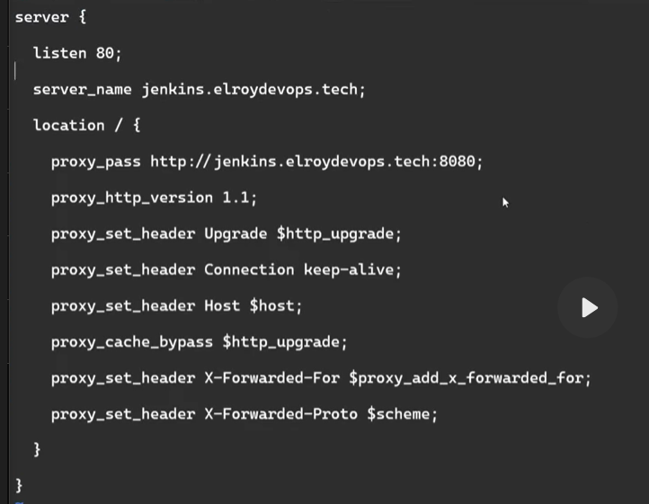
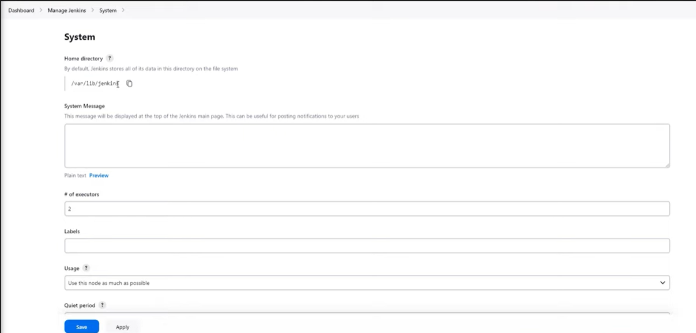

elroydevops.tech
# DEVOPS
- Là tổ hợp của văn hóa, con người và công cụ
- Tạo sao áp dụng nó cho doanh nghiệp 
    ## Linux 
        - Tối ưu hóa hiệu suất và chi phí 
        - Bảo mật và ổn định
        - Khả năng kiểm soát và linh hoạt 
        - Phát triển và cập nhật 
        - Tương thích đa nền tảng
        - Cộng đồng phát triển lớn
        
    - Các lệnh hay làm việc: 
        -   useradd và adduser:  đều tạo ra 1 user nhưng useradd chỉ tạo ra user, không tạo ra thư mục và các giá trị khác giống adduser
        - deluser: xóa user
        - groupadd: thêm nhóm - delgroup: xóa nhóm
        - thêm user vào nhóm: usermod -aG : 
            - a: thêm vào 
            - G: liệt kê danh sách các group 
            - nếu k thêm -G vào thì sẽ xóa hết các user khác khỏi group 
        - Phân quyền:
            chown -R root:devops2: đổi nhóm sở hữu tất cả file con ở dưới luôn 
        - Quyền truy cập: 
            - chmod g=rwx datas/ : cấp quyền cho group 
       ### Tư duy để triển khai dự án 
            - đều p có công cụ để triển khai tương ứng
            - Phiên bản phải lớn hơn hoặc bằng yeeu cầu của dự án 
            - Trong dự án đều chia làm 3 file
                - file chức năng: code, giỏ hàng ,...
                - file cấu hình: file devops cần quan tâm 
                - file khác: 
            - Có 2 bước triển khai:
                - Build và Run
            - Công cụ gì? File cấu hình ở đâu?, làm sao để build? Run thế nào? 
            Trong mỗi dự án đều có thư mục làm việc riêng và user riêng cho dự án
       ### Triển khai các dự án Frontend:
            Tạo thư mục project riêng, tạo người dùng và phân quyền thư mục, tệp 
            - Tạo thư mục /projects và copy todolist đã giải nén vào 
            - Tạo user todolist và phân quyền thư mục 
            - Chown -R todolist:todolist /projects/todolist
            - Chmod -R 750 /projects/todolist 
            
            - Tìm kiếm các ngôn ngữ, công cụ cần build trên gg vd: how to build vue project -> yêu cầu cài node js và npm 
            - curl -fsSL https://deb.nodesource.com/setup_18.x | sudo -E bash -
            - sudo apt install -y nodejs
            - node --version
            - apt install npm -y
                
            - Cài đặt các công cụ cần thiết
            - Chú ý các file cấu hình: vd: package.json -> scripts: ...., vue.config.js -> xem thử sử dung port bao nhiêu 
            
            - Build dự án bằng serve, web server, service tự tạo
            - npm install	
            - npm run build
            - npm run start
            - netstat -tlpun 
            
        ### Build bằng webserver nginx
            - Tải về và kiểm tra hoạt động
            - Vào thư mục conf.d/ để tạo ra 1 file .conf cho riêng trang web 
            - conf.d/todolist.conf 
                - server {
                    listen 8081;
                    root /projects/todolist/dist/;
                    index index.html;
                    try_files $uri $uri/ /index.html;
                }
            - Khởi động lại kiểm tra trang web, nếu vẫn không thể truy cập thì xem lại phân quyền, đã thêm nginx vào groups hay chưa 
            - Khởi dộng và hoàn thành nginx -s reload 
            - vào kiểm tra thấy lỗi 500 là do chưa cho www-data của nginx vào group của todolist 
            - usermod - aG todolist www-data
                
        ### Build bằng service 
            - Tạo 1 file trong /lib/systemd/system/<tên file>.service
                -	[Service]
                    Type=simple
                    User=vision
                    Restart=on-failure -> service bị down thì tự động khởi động lại 
                    WorkingDirectory=/project/<lưu trữ>
                    ExecStart=npm run start -- --port=3000
            - Systemctl daemon-reload
            - Systemctl start vision 
            - Systemctl status vision 
            -> kiểm tra trên trình duyệt với ip 3000 
            kiểm tra cổng bằng netstat -tlpn 
        ### Triển khai các dự án backend
            - Cài đặt công cụ cần thiết => công cụ
            - Xem và sửa file cấu hình => file cấu hình 
                - check xem có file pom.xml hay không => 
            - Cài đặt và thiết lập database => công cụ 
                - Cấu hình port ở đâu, đến database nào 
                - thấy tìm file application.properties -> config database spring boot 
                    /src/main/source/ 
                
                - check port 3306 đang ở dạng local hay không 127.0.0.1:3306, các server khác không thể truy cập đến được 
                    -> đổi thành 0.0.0.0 -> stop mariadb -> vào config /etc/mysql/mariadb.conf.d/50-server.cnf 
                    -> sửa bind-address
                - Thêm dự án, file ,sql vào database => tạo database, tạo user tương ứng 
                    mysql -u root 
                    show database;
                    create database shoeshop; 
                    create user 'shoeshop'@'%' identified by 'shoeshop'; # '%' -> phạm vi truy cập đến tất cả các server 
                    grant all privileges on shoeshop.* to 'shoeshop'@'%'; # -> Gán quyền cho user đó đủ quyền tác động lên database đó áp dụng lên '*': áp dụng tất cả tài nguyên của shoeshop
                    flush privileges; # lưu lại quyền đã được thay đổi 
                - Truy cập vào database 
                    mysql -h: host 123.123.123.169 -P:port 3306 -u:user shoeshop -p
                    show database
                    use shoeshop;
                    show tables;
                    source /project/shoeshop/shoe_shopdb.sql
                    show tables;
                - Sửa file cấu hình của database 'application.properties' 
            - Build dự án => build 
                mvn install -DskipTests=true # Bỏ qua quá trình test trực tiếp của tool 
                - java -jar target/....
            - Run dự án => run 
            - Kiểm tra hoạt động => check
            - câu lệnh chạy ngầm để xem log
                nohup java -jar target/shoe-ShoppingCart-0.0.1-SNAPSHOT.jar 2>&1 &
                ps -ef | grep shoe
                kill -9

    ## Git
    - Bao gồm 3 phần: môi trường phát triển, testing, chạy thật
        - Nhiều người phát triển
        - Theo dõi thay đổi 
        - kiểm soát quyền truy cập
        - quản lý phiên bản
        - Sao lưu và phục hồi 
        ### Git architecture 
        - git server
            - git push: đẩy lên remote repo
            - git pull: lấy về localrepo 
        - git local 
            - working directory -- (git add) --> staging area -- (git commit) --> localrepo 
                    <------------------ (git checkout, git merget) ---------------
        - Các bước tải gitlab và cấu hình 
            - Sử dụng một ubuntu server mới riêng vì gitlab cần sử dụng nhiều port 
            - Tải gitlab ee packages phiên bản từ 15 - 16, không cần cao 
                - curl -s https://packages.gitlab.com/install/repositories/gitlab/gitlab-ee/script.deb.sh | sudo bash
                - sudo apt-get install gitlab-ee=15.5.1-ee.0
                Sau đó chỉnh /etc/hosts với địa chỉ của server vd: gitlab.server.tech
                Sửa url của gitlab trong /etc/gitlab/gitlab.rb với địa chỉ đã cấu hình ở trên gitlab.server.tech
                Sau đó sửa ip của windown tìm host path windows -> C:\Windows\System32\drivers\ -> copy file host và xóa file -> sau đó đổi tên thành hosts origin, tạo 1 file mới tên host để là 192.168.1.100 gitlab.server.tech và copy vào chỗ cũ
                Chạy gitlab-ctl reconfigure
                - Tài khoản mặc định root: password -> cat/etc/gitlab/initial_root_password
            - Sau khi truy cập thành công hãy disable tạo mới tài khoản 2 dòng sign-up enabled và Require admin 
                - Truy cập CI/CD bấm Expand và bỏ cái Default to Auto DEVOPS .... 
        ### Những lệnh git thông dụng 
        - Mỗi dự án ta nên tạo 1 group để chứa những service của dự án đó 
        - Tạo group shoeshop -> new project shoeshop -> làm theo các yêu cầu của repository  
        - git config : ai là người đẩy code lên, 
        - git clone: kéo dự án mới trên gitlab server về máy 
        - Copy source code vào thư mục mới tạo | cp -rf shoeshop/* /data/shoeshop/ 
        - git status: xem trạng thái của git , đang ở đâu, có được add, commit gì chưa 
        - git checkout -b main : tạo ra 1 nhánh và đổi sang nhánh đó 
        - git status 
        - git add . : đưa code ở trạng thái working directory vào trạng thái staging area
        - git status ...
        - git commit -m "feat(project): create base project" -> :đưa code ở trạng thái staging area vào trạng thái localrepo
            - làm sao để tạo một comment tường mình: search git commit conversion https://www.conventionalcommits.org/en/v1.0.0/
        - git push -f origin ->: Đưa code ở localrepo lên trên git server 
            - gợi ý: git push --set-upstream origin main 
        - git pull: kéo code đã sửa ở trên git server về máy local
            ### Git workflow: Cách dùng git để quản lý source code và triển khai dự án ở trên các môi trường
            - Có các nhánh main, develop, feature, release, hotfix 
                - main: chứa code môi trường người dùng
                - develop: chứa code môi trường phát triển
                - feature: được tạo ra từ nhánh develop chứa code các chức năng, login, adduser, logout,... tùy theo từng cty
                - release: chứa code môi trường thử nghiệm
                - hotfixes: được tạo ra từ nhánh main 
            - Tạo các nhánh theo mô hình cho shoeshop
                - Tạo user dev1 và phân quyền là developer 
                - Tạo các nhánh và bảo vệ các nhánh quan trọng 
                - tag: đánh dấu mốc triển khai -> gắn cho 1 cái tên
## CI/CD : tối ưu quy trình làm việc, gia tăng sản phẩm và tiết kiệm tài nguyên của công ty 
- Tại sao lại quan trọng? -> Tối ưu trực tiếp tài nguyên của Cty
- Đã từng triển khai CI/CD 
- dev chỉ cần commit là code tự dộng build -> test -> deploy lên server  triển khai tự động và không cần thủ công.
	
	### Được chia thành 2 phần CI(continuous integration) và CD(continuous deployment/ delivery)
	- CI: Chính là bước clone code, build dự án, tích hợp các công cụ test dự án như test perfroment, clean code, bảo mật và ... để đảm bảo chất lượng source code
	- CD: Có 2 chiến lược triển khai dự án, 
		- Triển khai hoàn toàn tự động (chỉ cần 1 dòng commit code là chức năng mới sẽ được triển khai ) 
			- Tối ưu về mặt hiệu suất 
		- Triển khai thủ công (cần bước xác nhận để triển khai dự án hoặc sử dụng các chức năng)
			- Tăng khả năng kiểm soát 
	- Có thể tận dụng được điểm mạnh của cả 2 phương án tích hợp ra 1 quy trình tốt nhất cho doanh nghiệp đảm bảo cho việc nhanh và chất lượng 
		- Công cụ gitlab CI/CD và Jenkins
			- Tại sao dùng?
	### Cài đặt gitlab-runner để triển khai CI/CD
	- Cài 1 con robot kết nối vào gitlab trên con lab server: gitlab runner
	
			curl -L "https://packages.gitlab.com/install/repositories/runner/gitlab-runner/script.deb.sh" | sudo bash
			sudo apt install gitlab-runner -y
			gitlab-runner -v 

	- Kết nối github-runner với gitlab: trên Gitlab server Setting -> CI/CD -> Runners -> copy token -> bỏ xuống dưới 
			
			gitlab-runner register
 			http://gitlab.server.tech/
			- token :.... GR1348941wWb9Y-NjPGYZokHYiD3i 
			- deploy-project, deploy-project 
			- executor shell -> những câu lệnh chạy thì sẽ chạy trực tiếp trên server, docker -> tạo ra 1 môi trường độc lập và chạy nhũng câu lệnh trên những kịch bảng đó , kubernetes
			
	- Mở file config /etc/gitlab-runner/config.toml  
		- chỉnh concurrent = 4 => con runner này có thể chạy đồng thời 4 dự án
		- Sau đó chạy dòng sau để khởi động dự án: 
			
				gitlab-runner run --working-directory /home/gitlab-runner/ --config /etc/gitlab-runner/config.toml --service gitlab-runner --user gitlab-runner
		- Hãy sử dụng nohup để có thẻ chạy nó trên nền: 
		
				nohub gitlab-runner run --working-directory /home/gitlab-runner/ --config /etc/gitlab-runner/config.toml --service gitlab-runner --user gitlab-runner 2>&1 &
		- Và có 1 file nohub.out 
		- Vào lại runner trong gitlab server để check 
	- Một số lưu ý khi cấu hình runner 
		- Active - Paused runners don't accept new jobs -> bỏ chọn thì runner sẽ không được online 
		- Protected - This runner will only run on pipeline triggered on protected branches -> nếu tick chọn vào thì những nhánh nào được bảo vệ mới được chạy thôi 
		- Run untagged jobs - Indicates whether this runner can pick jobs without tags -> Tích chọn vào khi cấu hình kịch bản nó sẽ trực tiếp chạy trên những chon runner được kết nối đến dự án đó mà không cần chỉ định chính xác 
		- Lock to current projects - When a runner is locked, it cannot be assigned to other projects -> Khi tích chọn vào thì các dự án khác sẽ không được sử dụng con runner này 
			- Bỏ tích chọn sẽ giúp con runner chạy được trên nhiều dự án khác mà không cần tạo 1 runner mới để chạy dự án 
	### Viết file .gitlab-ci.yml triển khai CI/C Deployment (tự động hóa)
	- Viết file cấu hình công việc viết trực tiếp trong dự án và fomat tên file là .gitlab-ci.yml
	- Viết file đó vào cùng cấp cao nhất của dự án 
	- Vào Setting -> repository -> chỉnh develop push là maintainers
	- Tạo file .gitlab-ci.yml

			stages: 
				- build
				- deploy
				- checklog
			build:
				stage: build
				script:
					- ....
					...
					...
			
			-> commnit: Config(pipline): add build stage
			
			- viết xong vào CI/CD -> thấy stuck -> 0 thấy runner nào online vì khi không tích chọn lựa chọn thứ 2 ở bước cấu hình runner ở trên nên mình phải khai báo runner
			
			tags: 
				- deploy-project
			
			-> commit: Config(pipline): add runner -> CI/CD -> success 
	- Phân tích:
		- gitlab-runner sẽ kéo code về thư mục làm việc là /home/gitlab-runner/builds/.... -> không cần kéo code về 1 cách thủ công 
		- Sau đó là những câu lệnh đã khai ở script và nó sẽ đứng ở thư mục mà nó kéo code về 
		- Vậy là sau khi mà chỉnh sửa bất kỳ 1 cái gì đó trên gitlab server thì nó sẽ tự động build và xóa hoàn toàn code cũ trên máy server đi và thay thế code mới nhất 
				
		- Viết tiếp 
					
				stages: 
					- build
					- deploy
					- checklog
				build:
					stage: build
					script: 
						-mvn install -DskipTests=true -> câu lệnh build dự án -> tạo 1 file taget 
					tags: 
						- deploy-project
				deploy: 
					stage: deploy
					script:
						- 
					tags:
						- deploy-project
							
		- Tạo một thư mục /datas/shoeshop và user shoeshop 
			- Tiếp theo là cho phép github-runner được sử dụng sudo mà không cần password
			- Vào visudo, dưới dòng root thêm:

					github-runner ALL=(ALL)NOPASSWD: /bin/cp*
					github-runner ALL=(ALL)NOPASSWD: /bin/chown*
					github-runner ALL=(ALL)NOPASSWD: /bin/su shoeshop*

		- Nếu chạy luôn sau khi install ấy:
			- vd: -java -jar shoe-ShoppingCart-0.0.1-SNAPSHOT.jar
			- kết quả: bước build done và bước deploy đang fales vì mỗi step thì nó sẽ tiến hành xóa sạch code cũ ở trên server và tiến hành clone code mới mà code mới không có thư mục taget để chạy nữa
			- Và thêm 1 trường variables: GIT_STRATEGY: clone và bước deploy sẽ không tiến hành clone GIT_STRATEGY: none
			- commit Config(pipeline): change strategy runner
			=> chạy và thành công nhưng nó chạy bằng user root, trong thực tế sẽ chạy bằng user theo project là shoeshop
		- đến lượt cấu hình chạy cho đúng user 
							
				sudo cp target/shoe-ShoppingCart-0.0.1-SNAPSHOT.jar /datas/shoeshop 
		-  cấu hình thay đổi quyền sở hữu
							
				sudo chown shoeshop. /datas /shoeshop/
		- chuyển qua người dùng shoeshop và -c "" là chạy những câu lệnh nào ở trong đó, ; để sử dụng những câu lệnh tiếp theo 
						
				sudo su shoeshop -c "cd /datas/shoeshop/; nohub -java -jar shoe-ShoppingCart-0.0.1-SNAPSHOT.jar 2>&1 &" 
				-> commit config(pipeline): adđ script deploy stage -> chạy lỗi, trước khi chạy phải tiến hành kill tiến trình chạy trước đó 
			
		- Sử dụng ps -ef : kiểm tra tiến trình | grep shoe-ShoppingCart-0.0.1-SNAPSHOT.jar : lọc ra đúng tiến trình có tên là vầy | grep -v grep : lọc ra tiến trình đúng với cái tên đó thôi | awk '{print $2}' : sử lý dòng dữ liệu ở cột thứ 2
		- Sau đó muốn kill tiến trình sử dụng:
				
				kill -9 $(ps -ef | grep shoe-ShoppingCart-0.0.1-SNAPSHOT.jar | grep -v grep | awk '{print $2}')
		- Chỉnh sửa lại pipline: thêm - kill -9 $(ps -ef | grep shoe-ShoppingCart-0.0.1-SNAPSHOT.jar | grep -v grep | awk '{print $2}') vào trước câu lệnh chạy java -jar
		- tối ưu pipline bằng cách sửa những giá trị lặp lại lưu lại thành 1 biến ở toàn cục 

				variables:
					projectname: shoe-ShoppingCart
					version: 0.0.1-SNAPSHOT
					projectuser: shoeshop
					projectpath: /datas/shoeshop 
								
				- Và đổi các giá trị đó -> thành $... là thành công tin gọn 
		
		- Sửa kết nối đến database
		- Sửa nohub -java -jar shoe-ShoppingCart-0.0.1-SNAPSHOT.jar >nohub.out 2>&1 & thêm > nohub.out để lưu output ra file này 
		- Đã thành công nhưng vẫn chưa thành công tại vì khi commit thì tự động build vì khi sửa file readme hay gì đó k liên quan thì cũng k cần build lại dự án -> sửa lại pipeline
			- Thêm tùy chọn only: -tags bên trong build 	-> khi nào tags thì sẽ tự dộng build lại 
		- Thêm một stage: 

				showlog:
					stage: showlog 
					variables:
						GIT_STRATEGY: none
					script: 
						- sleep 20
						- sudo su $projectuser -c "cd $projectpath; tail -n 1000 nohub.out"
					tags:
						- deploy-project
					only:
						- tags

	-  Toàn bộ code cấu hình file .gitlab-ci.yml

			variables:
				projectname: shoe-ShoppingCart
				version: 0.0.1-SNAPSHOT
				projectuser: shoeshop
				projectpath: /datas/$projectuser/

			stages:
				- build
				- deploy
				- showlog
			build:
				stage: build
				variables:
					GIT_STRATEGY: clone
				script: 
					- mvn install -DskipTest=true
				tags:
					- labserver
				only:
					- tags
			deploy:
				stage: deploy
				variables:
					GIT_STRATEGY: none
				script:
					- sudo cp target/$projectname-$version.jar $projectpath
					- sudo chown -R $projectuser. $projectpath
					- sudo su $projectuser -c "kill -9 $(ps -ef | grep $projectname-$version.jar | grep -v grep | awk '{print $2}')"
					- sudo su $projectuser -c "cd $projectpath; nohup java -jar $projectname-$version.jar > nohup.out 2>&1 &"
				tags:
					- labserver
				only:
					- tags
			showlog:
				stage: showlog
				variables:
					GIT_STRATEGY: none
				script:
					- sleep 20
					- sudo su $projectuser -c "cd $projectpath; tail -n 1000 nohup.out"
				tags:
					- labserver
				only:
					- tags
			- Viết tiếp, thay đổi file .gitlab-ci.yml để triển khai CI/C Delivery (thủ công)
				- search keywork để sử dụng gitlab-ci "gitlab cicd syntax 
				- ở phần deploy, showlog thêm một tùy chọn:
				when: manual -> để có thể thực hiện run thủ công 
				mục đích của nó là chỉ có người nào mới có quyền được chạy, xác nhận 
				vd như sử dụng muốn triển khai môi trường cao hơn thì cái code đó phải quét qua các công cụ bảo mật hoặc clean code có 1 người aprule mới có quyền chạy 
				search "gitlab cicd variables refe" để tìm các biến -> gitlab user login
				thêm script như sau
				script:
					- > 
						if["$GITLAB_USER_LOGIN" == 'phucna']; then
							....
							....
						else
							echo "Permission denied"
							exit 1 -> dừng pipeline
						fi
## Docker (Cách triển khai container)
- Có một dự án cá nhân làm sao để chạy nó lên ở các tb khác nhau hoặc trên server thì đảm bảo có một công cụ nào đó để có thế sử dụng chúng -> docker
- Register Nơi chuyên biệt để lưu trữ các cục docker image và server kéo cục docker image đó về -> chạy trên container
- Là nền tản ảo hóa cấp container tạo ra mt độc lập cho phép người phát triển đóng gói ứng dụng và tât cả các phụ thuộc của nó vào 1 container duy nhất 
- Gọn nhẹ, không cồng kềnh
	### 1. Docker architecture 
	- source code dự án -> viết docker file -> sử dụng lệnh docker build -> build docker file -> đóng gói dự án thành 1 cục gọi là docker image -> push lên registry (docker hub hoặc là nơi lưu trữ tự tạo) docker container
	- muốn chạy thì kéo docker image đó từ registry về và chạy
	- Cài đặt và sd docker
	- tạo một thư mục chứa docker
		- mkdir -p /tools/docker/
		- Tạo ra 1 file sh để tự động cài đặt install-docker.sh 
		
				#!/bin/bash
				sudo apt update
				sudo apt install -y apt-transport-https ca-certificates curl software-properties-common
				curl -fsSL https://download.docker.com/linux/ubuntu/gpg | sudo gpg --dearmor -o /usr/share/keyrings/docker-archive-keyring.gpg
				echo "deb [signed-by=/usr/share/keyrings/docker-archive-keyring.gpg] https://download.docker.com/linux/ubuntu $(lsb_release -cs) stable" | sudo tee /etc/apt/sources.list.d/docker.list > /dev/null
				sudo apt update
				sudo apt install -y docker-ce
				sudo systemctl start docker
				sudo systemctl enable docker
				sudo curl -L "https://github.com/docker/compose/releases/latest/download/docker-compose-$(uname -s)-$(uname -m)" -o /usr/local/bin/docker-compose
				sudo chmod +x /usr/local/bin/docker-compose
				docker --version
				docker-compose --version
				
		- cấp quyền thực thi : chmod +x install_docker.sh
		-> chạy sh ... , ./, bash ,.... 
		- Là 1 môi trường độc lập như việc cài máy ảo server trên ubuntu 
		- Từ 1 cục image chạy nên 1 container và kéo image về từ docker hub
			- VD: muốn tải 1 ubuntu docker -> search "Ubuntu docker image" -> chọn version 
			- docker pull ubuntu:22.04 -> kéo 1 image tên ubuntu 
			- docker image
			- docker run --name ubuntu -it: truy cập vào môi trường container ubuntu:22.04 # chỉ sử dụng duy nhất 1 lần để chạy container đó lên thôi 
		- vào được môi trường container của ubuntu
			exit để thoát khỏi container
		- xem được các container : docker ps xem được trạng thái cái container đang chạy, thêm -a để xem tất cả các container có ở trên server
		- docker start ubuntu -> sử dụng container ubuntu, start = name hoặc = container id 3-4 số đầu 
		- docker exec -it ubuntu path -> truy cập lại môi trường container của ubuntu
		- VD: chạy một webserver nginx chẵn hạn -> đầu ra phải là port mới chạy đc webserver 

				docker run --name nginx -p 9999:80 nginx 
				docker run --name car-serv -dp 8888:80 elroydeveops/car-serv
			-> tự động tìm kiếm trên docker hub có 1 cái nginx -> version mới nhất nếu k thêm v dằng sau 
		- Dừng và xóa các container, docker image 
			- Dừng và xóa container
				
					docker stop ubuntu
					docker rm -f car-serv
			- Dừng và xóa docker image -> phải xóa container
				
					docker rm -f $(docker ps -a): xóa toàn bộ container hiện có
					docker images
					docker rmi ubuntu:22.04
	### 2. Cách dockerize các dự án 
	- Tư duy viết dockerfile 
		- Làm sao để tối ưu và bảo mật hơn 
		- File này sẽ tiến hành viết cấu hình để đưa các source code của bạn vào môi trường container và cài đặt các công cụ cần thiết để chạy dự án 
		- Các câu lệnh dockerfile
			VD để build được 1 dự án nodejs thì 
			- FROM + tên docker image (chứa 1 server) node:20 -> base image node js version 20 
			- Sau khi đã kéo một node base như 1 server về rồi ta cần chỉ định thư mục làm việc riêng cho nó 
			- WORKDIR/app -> tạo thư mục 
			- COPY.. -> copy toàn bộ source code của bạn từ trên server vào trên môi trường container 
				- Dấu . đầu tiên là vị trí hiện tại của dockerfile nếu dockerfile của bạn cùng cấp với các file dự án sẽ tiến hành copy hết file dự án
				- Dấu . thứ 2 nghĩa là vị trí hiện tại của container là vị trí ta chỉ định bằng workdir 
			- RUN: Chạy các câu lệnh linux
			- ENV: Khai báo các biến 
			- EXPOSE: Định nghĩa xem ứng dụng trong container sẽ được chạy trên port nào 
			- CMD: được sử dụng để xác định lệnh và giá trị mặc định
			- ENTRYPOINT: đc sd khi muốn giữ nguyên 1 lệnh cố định và cho phép lệnh được chỉ định khi cho phép 1 container thêm vào cuối của nó 
		- Viết tối ưu, bảo mật
			- None root user: Chạy ứng dụng bằng user khác 
			- BASE image: Chọn base image phù hợp, nếu đang chạy dự án java 8 nên tải maven java 8 để Build và run dự án được tối ưu dung lượng docker image đưa ra và hạn chế các công cụ không cần thiết khiên docker image nặng hơn 
				- Tìm kiếm docker image nào được build sẵn dựa trên alpine vì nó nhẹ và tối ưu, không cồng kềnh như ubuntu hay centos 
				- Chọn các image uy tín như office, verifiy, ...
				- Biết research để tìm ra các docker image phù hợp
				- Công cụ quét docker image, phải biết nó mắc lỗ hổng gì có nên chấp nhận nó k 
			- Multipe stage: giúp giảm kích thước docker image cuối cùng khi build ra
	### 3. Dockerfile dự án java backend
	- vi Dockerfile 
	- Công cụ maven: "maven docker image with java 8 alpine"
	1. build stage
	- kéo một server alpine đã được cài java 8 và maven về 
		- FROM maven 3.5.3-jdk-8-alpine as build
	- Chỉ định thư mục làm việc
		- WORKDIR /app
		- COPY . . 
	- Trong mt container chúng ta đã có một server đã cài java 8 và maven và code của dự án đã được copy vào trong đó
		- RUN mvn install -DskipTest=true
	2. run stage 
	- Sau đó chúng ta cần một base image nào đó chỉ cần java thôi không cần maven nên chúng ta phải tách riêng 1 bước run step như vậy 
	- Cái docker image cuối cùng, site của nó chỉ dựa vào bước cuối cùng bạn chạy thôi còn cái build ở trên sẽ không ảnh hưởng tới cái site image của b 
	- Site image chỉ dựa vào cái layer dưới thôi 
	- Search "java docker image version 8" -> recomment aws chọn 1 alpine: 8u402-alpine.jre
		- FROM amazoncorretto:8u402-alpine-jre
		- WORKDIR /run
	- Copy thư mục target/ ở trên bước build về bước run để khới chạy, thêm 1 tùy chọn as build ở build gán output của bước build vào trong build vào trong thư mục run 
		- COPY --from=build /app/target/shoe-ShoppingCart-0.0.1-SNAPSHOT.jar /run shoe-ShoppingCart-0.0.1-SNAPSHOT.jar
	- Cấu hình port và chạy dự án 
		- EXPOSE 8080
	- Câu lệnh khởi chạy 
		- ENTRYPOINT java -jar /run/shoe-ShoppingCart-0.0.1-SNAPSHOT.jar
	- Lưu lại thoát ra và chạy dự án dockerfile 
		- Docker build -t: "chỉ định tên của docker image" shoeshop:v1 -f Dockerfile.
	- chạy thành công và tiến hành kiểm tra và run nó lên 
		- docker images 
		- docker run --name shoeshop -dp 8888:8080 shoeshop:v1
		- docker ps -a 
	- chúng ta có 1 container đang chạy dưới port là 8888 -> kiểm tra trên trình duyệt 
	- push image đó lên 1 cái registry nào đó vd như docker hub và các server khác chỉ cần kéo image về, cài đặt docker và chạy lên trên thành container
	- sửa lại file tải 1 server về và cài đặt java lên đó 
		- cp Dockerfile Dockerfile-v2
		- vi Dockerfile-v2 
	- sửa ở bước run, tìm 1 cái "alpine docker image" -> alpine:3.19
		- FROM alpine:3.19
	- search "how to install java 8 on alpine"
		- RUN apk add openjdk8
	- lưu và chạy lại sửa port và tên 
	- Để mà nâng cấp dockerfile lên hơn ta tiến hành 1 version mới Dockerfile-v3
	- Sử dụng user khác để chạy dự án bằng cách tạo ra 1 user 
		- RUN addusser -D shoeshop trên RUN apk add openjdk8 
	- Và cần thay đổi quyền 
		- RUN chown -R shoeshop. /run trên EXPOSE
	- sử dụng keywork
		- USER shoeshop 
	- build thành công và chạy một container mới với port khác 
	- Xem log bằng lệnh 
		- docker logs -f shoeshop-v3 thêm -f để xem realtime 
	- Sử dụng câu lệnh đẻ truy cập vào môi trường container 
		- docker exec -it shoeshop-v3 sh
		- ls -l -> kiểm tra sở hữu 
	### 4. Dockerfile dự án frontend
	- Vào thư mục dự án, tạo file Dockerfile để cấu hình
	- Ta cần kéo một node:18.18-alpine, chỉ định thư mục làm việc và copy source code vào, chạy các lệnh install và build 
		
	- build stage
		- FROM node:18.18-alpine as build
		- WORKDIR /app
		- COPY . .
		- RUN npm install 
		- RUN npm build
	- Với các dự án vue js thì sẽ build ra 1 thư mục là dist đối với react thì sẽ build ra thư mục là build 
		
	- run stage 
		- FROM nginx:alpine
	- Copy vào trong thư mục chạy của nginx là /usr/share/nginx/html
		- COPY --form build /app/dist /usr/h
		- EXPOSE 80 
	- từng câu lệnh sẽ ở trong dấu nháy đôi
		CMD ["nginx", "-g","deamon off;"]
	- lưu file lại và chạy 
		- docker build -t todolist:v1
		- docker run --name todolist-v1 -dp 6868:80 todolist:v1
	- Hãy làm thêm các tính năng bảo mật 
	### 5. Cách thiết lập docker registry (triển khai registry server)
	- Là nơi lưu trữ các docker image
	- Có 3 cách: 
		- Dockerhub: Sd nhanh và miễn phí
		- Tạo ra 1 private registry riêng biệt (self-certified) registry sẽ chạy bằng https: 
		- Mua 1 domain, vps tạo registry bằng harbor (thực tế nhất)
	- C1: sử dụng dockerhub
		- Truy cập dockerhub -> đăng nhập vào 
		- Câu lệnh login: docker login
		- đổi định dạng của image để có thể push lên 1 nền tảng nào đó 
			- docker image = domain/project/repo:tag
			- docker tag todolist:v1 gitlab/todolist:v1
			- docker push todolist:v1
			- docker logout
		- xóa docker image 
			- docker rmi gitlab/todolist:v1
		- Kéo về 
			- docker pull ditlab/todolist:v1
	- C2: Nên tạo 1 server mới để cài đặt private registry 
		- Cài đặt docker 
		- Tạo một thư mục registry 
			- mkdir -p /tools/registry/ && cd /tools/registry
		- cài đặt xác thực ssl https: openssl
			- apt install openssl
		- chạy câu lệnh để có chứng chỉ ssl tự ký để có thể config với registry
			- mkdir data certs
			- openssl req -newkey rsa:4096 -nodes -sha256 -keyout certs/domain.key -subj "/CN=192.168.1.100" -addext "subjectAltName = DNS:192.168.1.100,IP:192.168.1.100" -x509 -days 365 -out certs/domain.crt
			- vi docker-compose.yml 
				version: '3'
				services:
					registry:
					image: registry:2
					restart: always
					container_name: registry-server
					ports:
						- "5000:5000"
					volumes:
						- ./data:/var/lib/registry
						- ./certs:/certs
					environment:
						REGISTRY_HTTP_TLS_CERTIFICATE: ./certs/domain.crt
						REGISTRY_HTTP_TLS_KEY: ./certs/domain.key
			- chạy câu lệnh:
				- docker-compose up -d
				- docker-compose ps
				- docker login 192.168.1.100:5000 -> failed vì tự ký và không có bên đứng ra xác nhận
			- username và password gõ gì cũng được
			- Search "Basic authen" 
			- tạo ra thư mục cert trong /etc/docker 
				- mkdir -p /etc/docker/certs.d/192.168.1.100:5000/
			- Copy và đổi tên 
				- cp certs/domain.crt vào -> /etc/docker/certs.d/192.168.1.100:5000/ca.crt
				- systemctl restart docker 
			- login lại thành công 
			- Để kéo được docker image từ registry-server thì cũng phải tạo một thư mục bên lab-server 
				- mkdir -p /etc/docker/certs.d/192.168.1.100:5000/
			- và tiến hành copy
				- scp certs/domain.crt anphuc@192.168.1.10:/home/anphuc
				- cp /home/anphuc/domain.crt /etc/docker/certs.d/192.168.1.100:5000/ca.crt
			- out ra và truy cập 192.168.1.100
			- thêm dự án vào regittry 
				- docker tag todolist:v1 192.168.1.100:5000/gitlab/todolist:v1
				- docker push 192.168.1.100:5000/gitlab/todolist:v1
	- C3 triển khai registry với domain (harbor registry)	
		- Cần domain và vps (dk tk aws miễn phí) hoặc k thì mua
		- Tạo 1 server tìm c2 -> launch install -> .... -> allown http, https
		- Vào instance -> bấm vào connect -> chú ý đến public ip -> connect -> thành công 
		- Truy cập vào giao diện quản lý domain vào trình quản lý domain -> tạo 1 bản ghi ->type A , name -> registry. ..., ip public
		- Ở trên registry-server cài docker 
		.... như ở trên 
		- Cài certbot: sẽ có 1 tổ chức đứng ra xác thực, domain này là tin cậy 
			- apt install certbot -y
		- tạo ra 1 thư mục harbor trong /tools/
			- cd harbor
			- curl -s https://api.github.com/repos/goharbor/harbor/releases/latest | grep browser_download_url | cut -d '"' -f 4 | grep '.tgz$' | wget -i -
			- tar xvzf harbor-offline-installer*.tgz
			- cd harbor/
			- cp harbor.yml.tmpl harbor.yml
			- export DOMAIN="registry.domain.cuaban"
			- export EMAIL="email@cuaban"
		- Tạo chứng chỉ tự động
			- sudo certbot certonly: lệnh con của chứng chỉ để lấy mà không cài đặt chúng 
				--standalone: sử dụng 1 webserer độc lập tích hợp với domain -d $DOMAIN --preferred-challenges http: xác thực thông qua gt https 
				--agree-tos: đồng ý với điều khoản-m: $EMAIL 
				--keep-until-expiring: giữ chứng chỉ hiện tại nếu nó vẫn còn hiệu lực
		- Sau đó chúng ta sẽ được 2 file 
			- vi harbor.yml -> sửa hostname thành domain của mình 
			- certificate: sửa thành dường dẫn mới chạy được /etc/letsencrypt/live/registry..online/fullchaine.pem
			- certificate: sửa thành dường dẫn mới chạy được /etc/letsencrypt/live/registry..online/privkey.pem
		- Thấy use và password mặc định database nữa 
		- Chạy file ./prepare 
		- cài ./install -> hệ thống tự cài cho mình 
		- Sử dụng docker-compose ps : hiển thị các danh sách compose đang chạy 
		- Try cập vào domain của mình -> vào giao diện harbor thành công 
		- User: admin, mk: trong file hồi nảy 
		- tạo project, phân luồng, ... 
		- Truy cập lại lab-server 
		- chạy lệnh:
			- docker login registry.domain...
		- User pass 
		- Sau đó có thể pull, push các dự án lên,...
			- docker tag registry.domain.../name_project/todolist:v1
			- push registry.domain.../name_project/todolist:v1
		- set whitelist ip mới có thể truy cập vào trang web để đảm bảo an ninh
	### 6. Các phần khác của docker 
	Bao gồm các phần như docker volume, docker compose, docker network
	- Docker volume
		-  Chúng ta sẽ có một thư mục chung liên kết giữa container và server 
		- VD ở trên dự án ta build được 1 thư mục là target/ chúng ta có thể cài đặt java và maven nhưng chúng ta chỉ cần sử dụng docker để build được ra thư mục đó mà k cần cài đặt java hay maven 
		- Build 1 thư mục target ở bên trong container /app và tiến hành mout ra bên ngoài "pwd".
			- docker run --rm -v 'pwd':/app --workdir="/app" maven:3.5.3-jdk8-alpine mvn install -DskipTests=true
				- rm: xóa container sau khi đã build đc 
				- v: Xác định thư mục kết nối giữa container và server 
		- Tạo 1 database bằng docker và sử dụng volume
		- Tạo 1 thư mục trước ở /db/mariadb-1
			- mkdir -p /db/mariadb-1
		- Sau đó chạy: 
			- docker run -v /db/mariadb-1/:/var/lib/mysql -e MYSQL_ROOT_PASSWORD=root -p 3307:3306 --name mariadb -d mariadb:10.6
				- v: xác định thư mục kết nối 
				- d: chạy dưới nền 
		- -> tạo ra được 1 container mới 
			- docker ps 
		Hoàn toàn có thể connect được db đó một cách bình thường, sử dụng lệnh 
			- mysql -h 192.168.1.110 -P 3307 -u root -p root
		- có thể kiểm tra dữ liệu đã được mout ra từ container ở /db/mariadb-1
	- Docker compose
		- Lưu trữ cấu hình, chỉnh sửa dữ liệu và chạy được nhiều ứng dụng 
		- docker-compose.yml 
			- version: '3.8' version của docker compose 
			- services: định nghĩa các container mà mình mong muốn
				db1: 
					image: mariadb:10.6
					volumes: 
						- /db/mariadb-1:/ var/lib/mysql
					enviroment: 
						MYSQL_ROOT_PASSWORD: root
					ports:
						- "3307:3306"
					container_name: mariadb-1
					restart: alwways: khi máy chủ bị tắt, docker được khởi động lên những cái container nào 
			- docker-compose up -d 
			- docker-compose ps
		- Có thể tạo ra 1 container khác bên trong nó 
			- vi src/main/re..../application.pp
			- Sửa địa chỉ port cho đúng 
			- Sửa file docker-compose 
			- vi docker-compose.yml
				- app-backend: 
					image: shoeshop:v3
					ports:
						- "8081:8080"
					container_name: shoeshop-1
					restart: always
			- docker-compose up -d 
			- docker-compose ps
	- Docker network
		- Như ở trên trong file compose ta có 2 container tương ứng với 2 địa chỉ mạng khác nhau 
		- Kiểm tra bằng lệnh
		- docker inspect mariadb-1, shoeshop-1
	### Triển khai gitlab CI/CD dự án docker 
	- Vào gitlab server project shoeshop sau đó chuyển sang nhanh staging 
	- Tiến hảnh merge code từ nhanh develop sang nhánh staging 
	- Quay lại lab server và tiến hành đổi user sang gitlab-runner và kiểm tra docker ps 
	- -> không chạy được, không đủ quyền 
	- Sử dụng lệnh:
		- usermode -aG docker gitlab-runner
		- su gitlab-runner 
		- docker ps 
	- Sửa file gitlab.ci.yml
		- Xóa phần scrip của build và deploy đi 
		- Build phải có docker file 
			- cat /data/shoeshop/Dockerfile-v3 
		- Copy nội dung và tạo 1 file Dockerfile mới vào staging.
		- đặt cái tên làm sao theo định dạng domain/project/name-project
		- Vào setting CI/CD ở variable add 3 biến 
			key = REGISTRY_URL
			value = registry.domain
			bỏ tick protect 
			
			key = REGISTRY_USER
			value = admin
			bỏ tick protect 

			key = REGISTRY_PROJECT
			value = project-name

			key = REGISTRY_PASSWORD
			value = Anphuc@1231
		- search "gitlab runner variable list"
		-> CI_PROJECT_NAME -> CI_COMMIT_TAG
			- variables:
				- //domain/project-registry/project-gitlab:tag_commit
				- DOCKER_IMAGE: $(REGISTRY_URL)/$(REGISTRY_PROJECT)/$(CI_PROJECT_NAME):$(CI_COMMIT_TAG)_$(CI_COMIT_SHORT_SHA)
				- registry.gitserver.online/project/shoeshop:v10.0.1_asddsfas
		- Trước đó hãy login vào registry trước:
			- stage: buildandpush
			- before_script
				- docker login $(REGISTRY_URL) -u $(REGISTRY_USER) -p $(REGISTRY_PASSWORD)
			- script:
				- docker build -t $DOCKER_IMAGE . 
				- docker push $DOCKER_IMAGE
			- commit: config(pipeline): add buildandpush
		- Sau khi đã deploy và push lên xong chuyển sang bước deploy
		- Thêm bước login vào registry
		- variable:
			- DOCKER_CONTAINER: $CI_PROJECT_NAME
			- before_script
				- docker login $(REGISTRY_URL) -u $(REGISTRY_USER) -p $(REGISTRY_PASSWORD)
			- script:
				- docker pull $DOCKER_IMAGE
			
		- Nếu docker đó đang chạy thì xóa nó 
			- docker rm -f $DOCKER_CONTAINER
			- docker run --name $DOCKER_CONTAINER -dp 8080:8080 $DOCKER_IMAGE
		- Sửa showlog 
			- script:
				- docker log $DOCKER_CONTAINER
		- commit: config(pipeline): add deploy and showlog stage
	## Jenkins: công cụ tự động hóa công việc 
		- Là 1 máy chủ tự động hóa mã nguồn mở hàng đầu, cung cấp hàng trăm plugin hỗ trợ triển khai và tự động hóa bất kỳ dự án nào
		- Sử dụng ngôn ngữ Groovy
	### Cài đặt jenkins
	1. Tạo 1 server Jenkin riêng
	- Thay đổi ip
		- 192.168.1.101
	2. Tạo thư mục chứa tool và tải về 
	- VD: /tools/jenkins
		- mkdir -p /tools/jenkins
		- cd /tools/jenkins
		- vi jenkins-install.sh

				#!/bin/bash
				apt install openjdk-17-jdk openjdk-17-jre -y
				java --version
				wget -p -O - https://pkg.jenkins.io/debian/jenkins.io.key | apt-key add -
				sh -c 'echo deb http://pkg.jenkins.io/debian-stable binary/ > /etc/apt/sources.list.d/jenkins.list'
				apt-key adv --keyserver keyserver.ubuntu.com --recv-keys 5BA31D57EF5975CA
				apt-get update
				apt install jenkins -y
				systemctl start jenkins
				ufw allow 8080
		- chmod +x jenkins-install.sh
		- sh jenkins-install.sh	
	3. Sửa host để có thể truy cập bằng tên miền gitlab và jenkins
		- vi /etc/hosts
			- 192.168.1.101 jenkins.server.tech
	4. Truy cập giao diện web và nhập password từ hiển thị của giao diện
	- Nhấn vào suggetion để tự tải cấu hình 
	5. Tạo user và password, và chuyển từ port 8080 sang port 80 
	- Sử dụng 1 web server và viết 1 file cấu hình từ port 8080 sang port 80 
		- apt install nginx 
		- cd /etc/nginx
		- vi conf.d/jenkins.server.tech.conf 

				
		
		- systemctl restart nginx
	- bỏ port 80 được rồi 
	6. Các chức năng mới
	- Vào manage jenking
		- file cấu hình nằm trong /var/lib/jenkins
		- Và cũng có 1 user jenkin tương ứng 

		
	
	- Plugins
		- Sẽ chứa những plugins và thêm plugins ở đây
	- Nodes
		- Sẽ tiến thành thêm server, agent vào trong jenkin server 
	- Security
		- Xác định được cách mình login 
		- Mặc định sẽ k có phân quyền, phải cài plugins và phân quyền cụ thể 
	- Credentials
		- Sẽ lưu những cái tài khoảng mật khẩu, những cái mã hóa , bảo mật ,... 
	- Jenkins CLI
		- Giúp hoàn toàn tự động mọi thứ 
	### Jenkins CI/CD
		- Tiển khai dự án hoàn toàn tự động
		- Sử dụng agent chứ k phải ssh
		- Có thể sử dụng ssh nhưng hạn chế với việc sử dụng jenkins -> nên sử dụng agent thay vì ssh, vì dễ dàng cấu hình, cài đặt và an toàn vì khi sd ssh là kết nối "ngang hàng" nên nếu không cẩn thận có thể làm die server 
	- ### Cài đặt jenkins agent
		- Trên các server  mà muốn cài đặt phải đều có java và version của java phải tương ứng với jenkins server 
		- Nếu trên con server đã cài sẵn java rồi vd java 17 mà muốn cài thêm 1 con java 11 cho phù hợp với server và muốn java 11 này làm mặc định thì sử dụng các câu lệnh 

				sudo apt install openjdk-11-jdk -y
				update-alternatives --config java 
				java -version
		- Tạo 1 user jenkins
			- adduser jenkins 
		- Sau đó vào manage jenkins -> Nodes -> Khai báo server -> new node 
			- Number of executor: trong 1 thời điểm có bao nhiêu dự án, pipeline được phép chạy 
			- lables: tên server 
			- custom workDir /var/lib/jenkins 
			- Cần đi vào port nào đó và mở 1 đầu vào cho agent đi vào ở server 
			- vào lại sercurity -> agents -> fixed port (chọn port nào chưa có dịch vụ chạy vd 8999)
			

	## Monitoring: