Mục lục
- [1. Khởi đầu](#1-khởi-đầu)
  - [1.1. Kubernetes là gì? (K8S) {c}](#11-kubernetes-là-gì-k8s-c)
  - [1.2. Mô hình triển khai](#12-mô-hình-triển-khai)
  - [1.3. Khi nào nên sử dụng k8s](#13-khi-nào-nên-sử-dụng-k8s)
  - [1.4. Hạ tầng k8s](#14-hạ-tầng-k8s)
    - [1.4.1. Kiến trúc k8s](#141-kiến-trúc-k8s)
    - [1.4.2. Lấy ví dụ về mô hình](#142-lấy-ví-dụ-về-mô-hình)
- [2. Cài đặt cụm k8s](#2-cài-đặt-cụm-k8s)
  - [2.1. Phương pháp cài đặt](#21-phương-pháp-cài-đặt)
    - [2.1.1. Cài đặt trên On-premise](#211-cài-đặt-trên-on-premise)
    - [2.1.2. Cloud](#212-cloud)
- [3. Triển khai dự án thực tế](#3-triển-khai-dự-án-thực-tế)
  - [3.1. Quy trình kiến khai dự án k8s](#31-quy-trình-kiến-khai-dự-án-k8s)
    - [3.1.1. Yaml trong k8s](#311-yaml-trong-k8s)
    - [3.1.2. Namespace k8s](#312-namespace-k8s)
  - [3.2. Tư duy triển khai dự á trên Kubernetes](#32-tư-duy-triển-khai-dự-á-trên-kubernetes)
  - [3.3. Các công cụ quản lý k8s](#33-các-công-cụ-quản-lý-k8s)
  - [3.4. Cài đặt Rancher và kết nối Kubernetes](#34-cài-đặt-rancher-và-kết-nối-kubernetes)
    - [3.4.1. Rancher làm được gì?](#341-rancher-làm-được-gì)
    - [3.4.2. Các cách cài đặt](#342-các-cách-cài-đặt)
      - [3.4.2.1. Chạy bằng docker](#3421-chạy-bằng-docker)
      - [3.4.2.2. Cài đặt trên Rancher trên Cloud (GCP)](#3422-cài-đặt-trên-rancher-trên-cloud-gcp)
  - [3.5. Pod K8s](#35-pod-k8s)
    - [3.5.1. Triển khai ví dụ một pod](#351-triển-khai-ví-dụ-một-pod)
      - [3.5.1.1. Cấu hình chịu tải cho pod](#3511-cấu-hình-chịu-tải-cho-pod)
  - [3.6. Deployment k8s](#36-deployment-k8s)
    - [3.6.1. Ví dụ một file yaml Deployment đơn giản](#361-ví-dụ-một-file-yaml-deployment-đơn-giản)
  - [3.7. Các câu lệnh Deployment K8s](#37-các-câu-lệnh-deployment-k8s)
  - [3.8. Các chiến lược deployment k8s](#38-các-chiến-lược-deployment-k8s)
    - [3.8.1. Rolling Update](#381-rolling-update)
    - [3.8.2. Recreate](#382-recreate)
  - [3.9. Services](#39-services)
    - [3.9.1. NodePort](#391-nodeport)
      - [3.9.1.1. On-premit](#3911-on-premit)
      - [3.9.1.2. On Cloud](#3912-on-cloud)
    - [3.9.2. ClusterIP](#392-clusterip)
  - [3.10. Helm](#310-helm)
    - [3.10.1. Mục đích của Helm](#3101-mục-đích-của-helm)
    - [3.10.2. Cấu trúc của Helm Chart](#3102-cấu-trúc-của-helm-chart)
    - [3.10.3. Một số lệnh Helm cơ bản](#3103-một-số-lệnh-helm-cơ-bản)
    - [3.10.4. Helm Repo là gì?](#3104-helm-repo-là-gì)
    - [3.10.5. Lợi ích của Helm](#3105-lợi-ích-của-helm)
  - [3.11. Ingress](#311-ingress)
    - [3.11.1. On-Premit](#3111-on-premit)
      - [3.11.1.1. Thành phần chính của Ingress:](#31111-thành-phần-chính-của-ingress)
      - [3.11.1.2. Cài đặt và cấu hình Nginx Ingress Controller](#31112-cài-đặt-và-cấu-hình-nginx-ingress-controller)
      - [3.11.1.3. Triển khai loadbalancer](#31113-triển-khai-loadbalancer)
    - [3.11.2. On Cloud](#3112-on-cloud)
  - [3.12. Template yaml](#312-template-yaml)
  - [3.13. Triển khai dự án Fullstack](#313-triển-khai-dự-án-fullstack)
    - [3.13.1. Mô hình dự án](#3131-mô-hình-dự-án)
      - [3.13.1.1. Frontend](#31311-frontend)
      - [3.13.1.2. Backend](#31312-backend)
  - [3.14. Configmaps](#314-configmaps)
    - [3.14.1. Mục đích sử dụng ConfigMap](#3141-mục-đích-sử-dụng-configmap)
    - [3.14.2. Cách tạo và sử dụng ConfigMap](#3142-cách-tạo-và-sử-dụng-configmap)
    - [3.14.3. Lưu ý](#3143-lưu-ý)
  - [3.15. Secret](#315-secret)
    - [3.15.1. Các loại secret phổ biến](#3151-các-loại-secret-phổ-biến)
    - [3.15.2. Cách sử dụng](#3152-cách-sử-dụng)
  - [3.16. Request và limit](#316-request-và-limit)
    - [3.16.1. Mục đích:](#3161-mục-đích)
    - [3.16.2. Khác biệt](#3162-khác-biệt)
    - [3.16.3. Các loại tài nguyên chính](#3163-các-loại-tài-nguyên-chính)
- [4. Xây dựng công cụ dự án](#4-xây-dựng-công-cụ-dự-án)
- [5. Giám sát và quản trị Kubernetes](#5-giám-sát-và-quản-trị-kubernetes)
- [6. Triển khai k8s trên k3s](#6-triển-khai-k8s-trên-k3s)
  - [6.1. Bước 1: Gỡ cài đặt Kubernetes (kubeadm, kubelet, kubectl)](#61-bước-1-gỡ-cài-đặt-kubernetes-kubeadm-kubelet-kubectl)
  - [6.2. Bước 2: (Tuỳ chọn) Gỡ containerd (nếu muốn dùng k3s tự cài containerd riêng)](#62-bước-2-tuỳ-chọn-gỡ-containerd-nếu-muốn-dùng-k3s-tự-cài-containerd-riêng)
  - [6.3. Bước 3: Tắt swap (bạn đã làm rồi), vẫn giữ nguyên.](#63-bước-3-tắt-swap-bạn-đã-làm-rồi-vẫn-giữ-nguyên)
  - [6.4. Bước 4: Cài đặt K3s](#64-bước-4-cài-đặt-k3s)
    - [6.4.1. Cấu hình sysctl](#641-cấu-hình-sysctl)
    - [6.4.2. Cài đặt k3s trên node đầu tiên (192.168.1.111)](#642-cài-đặt-k3s-trên-node-đầu-tiên-1921681111)
    - [6.4.3. Cài đặt k3s trên node thứ hai (192.168.1.112)](#643-cài-đặt-k3s-trên-node-thứ-hai-1921681112)

# 1. Khởi đầu
## 1.1. Kubernetes là gì? (K8S) {c}

```
Là nền tảng mã nguồn mở để tự động triển khai, scaling, mở rộng và quản lý các ứng dụng đóng gói trong container, hoạt động như một hệ điều hành cho các container (thường là Docker)
```

## 1.2. Mô hình triển khai
- Mô hình triển khai
    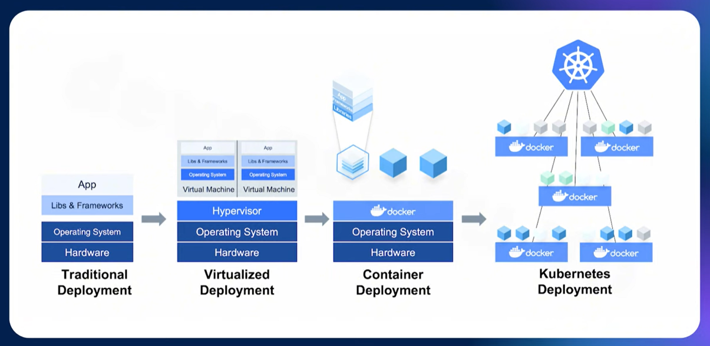
## 1.3. Khi nào nên sử dụng k8s 
- Cần phải đảm bảo 4 yếu tố để áp dụng giải pháp nào đó: Hiệu quả, vận hành, minh bạch, khả năng vận hành, tối ưu chi phí

    
## 1.4. Hạ tầng k8s
### 1.4.1. Kiến trúc k8s 

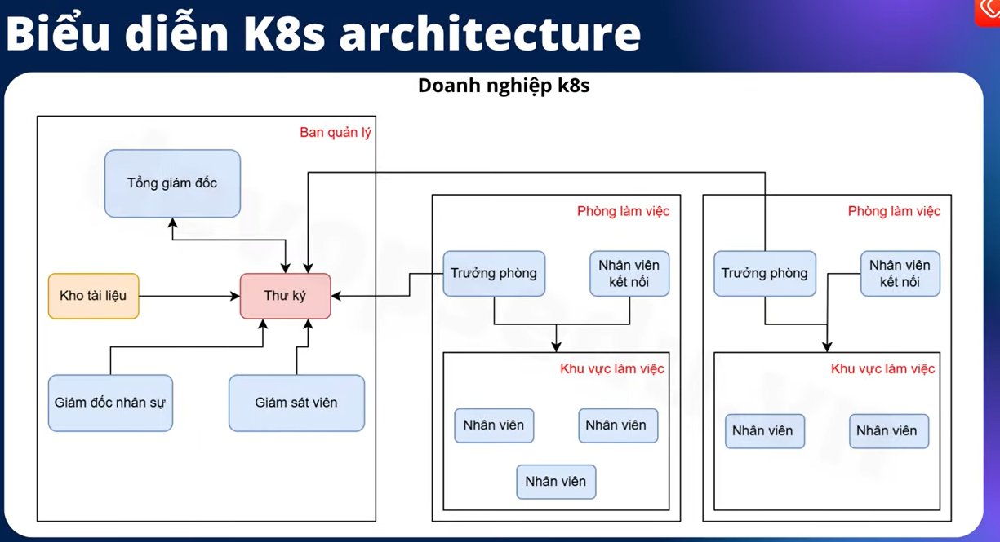

### 1.4.2. Lấy ví dụ về mô hình
- Trong 1 công ty thì có: 
    - Ban quản lý có chứa:  
        - 1 ông giám đốc thường sẽ 0 lam vc trực tiếp với mn mà sẽ thông qua 1 thư ký
        mn sẽ nhận yc cũng như đưa yc đến trợ lý này.
        - VD: Ai muốn gặp GD sẽ phải gặp thư ký dể sắp xếp lịch hay những yc về nv ban xuống 
        - CTy sẽ có vp để lưu trữ những tài liệu về thuế, nhân sự, phòng ban,...(Kho tài liệu)
        - Có 1 ông GD nhân sự: chịu trách nhiệm phân bổ nhân viên vào các phòng ban phù hợp dựa trên khả năng và yc của từng dự án, ô này sẽ xem phòng ban nào sẽ cần nv sau đó sẽ đưa nv vào đúng vị trí.
        - Để đảm bảo công việc được trơn tru thì sẽ có một cá nhân hoặc 1 phòng ban giám sát chất lượng là người theo dõi cv hằng ngày để đảm bảo rằng mọi thứ đều được hd trơn tru. 
        VD: nếu có vấn đề về nhân viên nghỉ vc thì bộ phận giám sát này sẽ ngay lập tức thay thế hoặc bàn giao cv mới cho nhân sự mới để đảm bảo công việc sẽ không bị đình trệ
    - Có các phòng ban làm việc chung: {c}
        - Từng phòng ban sẽ có trưởng phòng: có trách nhiệm quản lý và theo dõi công việc của phòng ban mình, khi ban quản lý giao nv thì trưởng phòng sẽ đảm bảo rằng mọi người đều hiểu và thực hiện đúng công việc nv của mình 
        - Nhân sự làm vc chuyên môn, mỗi bạn sẽ có 1 hoặc nhiều kĩ năng chuyên môn. VD: code fullstack, AI,...
        - Nhân viên kết nối: Các phòng ban giao tiếp được với nhau và giao tiếp đi ra bên ngoài sẽ có 1 nhân sự hỗ trợ ở các phòng giúp vc hợp tác giữa các nhân sự được trơn tru hơn


- Control Plane: (ban quản lý):
    - Cloud-control-manager: Nếu cụm k8s cần cloud thì sẽ có.
    - kube-api-server: Là 1 api để có 1 quy chuẩn chung để giao tiếp ở ngoài vào trong cụm. 
    - etcd: cơ sở dữ liệu phân tán, lưu trữ mọi cấu hình của k8s các trạng thái của pod, node các tài nguyên ý như một kho lưu trữ.
    - scheduler: Trách nhiệm phân phối pod đến các node ở trong cluster và xem xét các yếu tố như tài nguyên, cpu, ram, các chính sách, các yc cụ thể khác. (VD: Chỉ định pod vào cái node nào ), chạy một thực toán lập lệnh để tối ưu hóa phân bổ work lot: xác định xem node nào có tài nguyên phù hợp nhất để triển khai các pod lên.
    - Controller Manager: quản ý các controller là những tiến trình chịu trách nhiệm giám sát trạng thái của cluster và thực hiện các hành động sửa chữa tự động nếu cần (pod có vấn đề thì CM sẽ quản lý).
- Node: Có nhiều node tương ứng với phòng ban làm việc trong đó
    - pod: nhân sự chuyên môn, một node sẽ có nhiều pod và 1 pod sẽ có nhiều container (đơn vị nhỏ nhất)
    - kubelet(trưởng phòng): Nhận yêu cầu từ kube-api-server để thực thi các pod trên nod (hay việc trưởng phòng sẽ giao và giám sát các công việc của các nhân sự ở trg phòng v)
    - kube-proxy (Nhân viên kết nối): Thành phần network chạy trên mỗi node để cho phép các pod giao tiếp với nhau và giao tiếp ra bên ngoài(hay kết nối các nhân sự với nhau)
# 2. Cài đặt cụm k8s
## 2.1. Phương pháp cài đặt
- Các cách thông dụng nhất: chọn cái phù hợp nhất
Search:"How many way are there to install kubernetes"
- Có 2 cách chính: thủ công(Kubeadm) và tự động (kyops)
### 2.1.1. Cài đặt trên On-premise
- Mô hình K8s cluster
    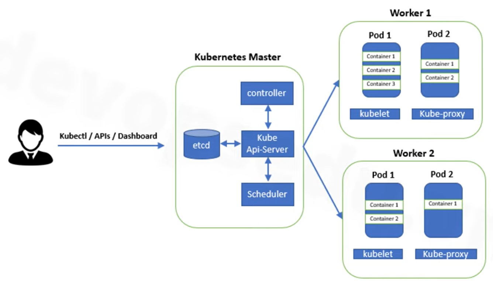
    - Server nào đóng vai trò là control plane thì mặc định nó không thể triển khai dự án lên đó
    - Việc điều hành có thể bị ảnh hưởng, gây ra cao tải và ảnh hướng đến server 
    - Một mô hình với 3 control plane và worker 
        - Có thể triển khai dự án trên cả 3 server 
        - Khá phổ biến 
        
        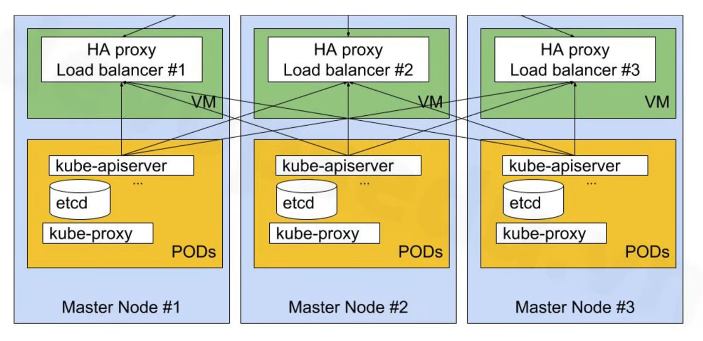
- Tạo các servers k8s
    - Tạo 3 server ubuntu 

    | Hostname	    |     OS	    |         IP	| RAM (tối thiểu) | CPU (tối thiểu) |
    |:-------------:|---------------|:-------------:|:---------------:|:---------------:|
    | k8s-master-1	| Ubuntu 22.04	| 192.168.1.111	|        3G	      |      2          |
    | k8s-master-2	| Ubuntu 22.04	| 192.168.1.112	|        3G	      |      2          |
    | k8s-master-3	| Ubuntu 22.04	| 192.168.1.113	|        3G	      |      2          |

    - Thực hiện trên cả 3 servers
        - Thêm hosts:(vi /etc/hosts): 
            - Nội dung cấu hình:

            ```
            192.168.1.111 k8s-master-1
            192.168.1.112 k8s-master-2
            192.168.1.113 k8s-master-3
            ```

        - Cập nhật và nâng cấp hệ thống
            ```
            sudo apt update -y && sudo apt upgrade -y
            ```
        - Tạo user devops và chuyển sang user devops
            ```
            adduser devops
            usermod -aG sudo devops
            su devops
            cd /home/devops
            ```
        - Tắt swapoff: 
          -  Tạm thời: `sudo swapoff -a`
          - Vĩnh viễn
            ```
            vi /etc/fstab 
            #/swap.img
            hoặc 
            sudo sed -i '/swap.img/s/^/#/' /etc/fstab
            ```
        - Cấu hình module kernel: `vi /etc/modules-load.d/containerd.conf`
            ```
            sudo tee /etc/modules-load.d/containerd.conf <<EOF
            overlay
            br_netfilter
            EOF
            ```
        - Tải module kernel
            ```
            sudo modprobe overlay
            sudo modprobe br_netfilter
            ```
        - Cấu hình hệ thống mạng:
            ```
            sudo tee /etc/sysctl.d/kubernetes.conf <<EOF
            net.bridge.bridge-nf-call-ip6tables = 1
            net.bridge.bridge-nf-call-iptables = 1
            net.ipv4.ip_forward = 1
            EOF
            ```
            Áp dụng cấu hình sysctl
            > sudo sysctl --system
        - Cài đặt các gói cần thiết và thêm kho Docker
            ```
            sudo apt install -y curl gnupg2 software-properties-common apt-transport-https ca-certificates
            sudo curl -fsSL https://download.docker.com/linux/ubuntu/gpg | sudo gpg --dearmour -o /etc/apt/trusted.gpg.d/docker.gpg
            sudo add-apt-repository "deb [arch=amd64] https://download.docker.com/linux/ubuntu $(lsb_release -cs) stable"
            ```
        - Cài đặt containerd 
            ```
            sudo apt update -y
            sudo apt install -y containerd.io
            ```
        - Cấu hình containerd        
            ```
            containerd config default | sudo tee /etc/containerd/config.toml >/dev/null 2>&1
            sudo sed -i 's/SystemdCgroup = false/SystemdCgroup = true/g' /etc/containerd/config.toml
            ```
            - Khởi động containerd
                ```
                sudo systemctl restart containerd
                sudo systemctl enable containerd
                ```
        - Thêm kho lưu trữ Kubernetes
            ```
            echo "deb [signed-by=/etc/apt/keyrings/kubernetes-apt-keyring.gpg] https://pkgs.k8s.io/core:/stable:/v1.30/deb/ /" | sudo tee /etc/apt/sources.list.d/kubernetes.list
            curl -fsSL https://pkgs.k8s.io/core:/stable:/v1.30/deb/Release.key | sudo gpg --dearmor -o /etc/apt/keyrings/kubernetes-apt-keyring.gpg
            ```
        - Cài đặt các gói Kubernetes
            ```
            sudo apt update -y
            sudo apt install -y kubelet kubeadm kubectl
            sudo apt-mark hold kubelet kubeadm kubectl
            ```
- Cài đặt k8s cluster 1 master 2 worker
    - Thực hiện trên server k8s-master-1
        ```
        sudo kubeadm init
        mkdir -p $HOME/.kube
        sudo cp -i /etc/kubernetes/admin.conf $HOME/.kube/config
        sudo chown $(id -u):$(id -g) $HOME/.kube/config
        (kiếm tra trạng thái các node)
        kubectl apply -f https://raw.githubusercontent.com/projectcalico/calico/v3.25.0/manifests/calico.yaml
        kubectl get nodes 
        ```
    - Thực hiện trên server k8s-master-2 và k8s master-3
        ```
        sudo kubeadm join 192.168.1.111:6443 --token your_token --discovery-token-ca-cert-hash your_sha
        ```
- Khối lệnh reset cụm khi đã khởi tạo cụm (áp dụng trên cả 3 server)
    ```
    sudo kubeadm reset -f
    sudo rm -rf /var/lib/etcd
    sudo rm -rf /etc/kubernetes/manifests/*
    ```
- Cài đặt k8s cluster 3 master worker
    - Thực hiện trên server k8s-master-1
        ```
        sudo kubeadm init --control-plane-endpoint "192.168.1.111:6443" --upload-certs
        mkdir -p $HOME/.kube 
            --control-plane-endpoint "192.168.1.111:6443": Chỉ định ai là master khi join vào
            --upload-certs: Xác thực cho các server khác muốn join vào
        sudo cp -i /etc/kubernetes/admin.conf $HOME/.kube/config 
        sudo chown $(id -u):$(id -g) $HOME/.kube/config
        kubectl apply -f https://raw.githubusercontent.com/projectcalico/calico/v3.25.0/manifests/calico.yaml
    - Thực hiện trên server k8s-master-2 và k8s-master-3 
        ```
        sudo kubeadm join 192.168.1.111:6443 --token your_token --discovery-token-ca-cert-hash your_sha --control-plane --certificate-key your_cert
        mkdir -p $HOME/.kube 
        sudo cp -i /etc/kubernetes/admin.conf $HOME/.kube/config 
        sudo chown $(id -u):$(id -g) $HOME/.kube/config
        ```        
    - Cấu hình để cả 3 control-plane đều làm việc
        ```
        kubectl taint nodes k8s-master-1 node-role.kubernetes.io/control-plane:NoSchedule-
        kubectl taint nodes k8s-master-2 node-role.kubernetes.io/control-plane:NoSchedule-
        kubectl taint nodes k8s-master-3 node-role.kubernetes.io/control-plane:NoSchedule-
        ```
### 2.1.2. Cloud 
[Google Cloud console](https://cloud.google.com/cloud-console?utm_source=bing&utm_medium=cpc&utm_campaign=japac-VN-all-en-dr-bkws-all-pkws-trial-e-dr-1710102&utm_content=text-ad-none-none-DEV_c-CRE_-ADGP_Hybrid+%7C+BKWS+-+EXA+%7C+Txt+-Management+Tools-Cloud+Console-google+console-main-KWID_43700080475310202-kwd-71537784136902:loc-166&userloc_142907-network_o&utm_term=KW_console+google&gclid=41fd680d0d341fdaf6fa003bbd08b139&gclsrc=3p.ds&)
- Khởi tạo cụm K8s cloud
    - Kubenetes Engine -> Clusters -> Create (standard) 
    - Cluster basics: 
        - Tên đặt theo dự án, theo môi trường
        - Location: chọn asian để kết nối ổn định hơn 
        - Release channel: chọn kênh phát hành cho k8s trong cụm, chiến lược để nâng cấp cụm k8s giúp cân bằng giữa tính khả dụng của các tính năng mới và tính ổn định 
            Rapid: sử dụng những tính năng mới cảu GKE ngay khi vừa phát hành -> 0 ổn định
            Regular: Cân bằng giữa tính năng và tính ổn định, cập nhật các tính năng mới 1 cách có kiểm soát (nên chọn)
            Stable: phù hợp cho môi trường production cần tính ổn định hơn tính năng mới
            Extended: Giữ nguyên phiên bản trong 1 thời gian dài  kể cả khi nó đã bị kết thúc thời gian hỗ trợ chuẩn
            No channel: Không theo dõi bất kì channel nào và không tự động cập nhật -> gây khó khăn trong vc quản lý
    - Fleet registration: Cho phép gom nhóm và quản lý các cụm k8s giúp quản lý từng cụm riêng lẻ sang quản lý theo nhóm -> Tận dụng khả năng multi cluster (đa cụm) và áp dụng các policy nhất quán trên tổ chức giúp đồng nhất policy và vận hành 
    - default-pool: 
        - Compact placement: Các node sẽ được càng gần nhau -> hữu ích giúp tôi ưu hóa tài nguyên trên máy chủ vật lý 
        - Queued ...: 
        - size: số lượng node, sl server 
        - automation: tự động nâng cấp các node lên phiên bản có sẵn giúp cho các node theo các phiên bản mới, tự đọng bật sửa chữa 
    - node pool upgrade strategy: Chiên lược cập nhật của node
        - Surge update: bổ xung các node khi tiến hành cập nhật
        - Blue-green: pp tạo các node hoàn toàn mới và chuyển sang các node mới 
    - Nodes: Chọn cấu hình server (ubuntu)
        - Machine config: cấu hình phần cứng
    - Metadata:
        - k8s labels: gán nhãn
            - env: development
    - Backup plane
    -> create 
# 3. Triển khai dự án thực tế
## 3.1. Quy trình kiến khai dự án k8s
- Ví dụ quy trình:

    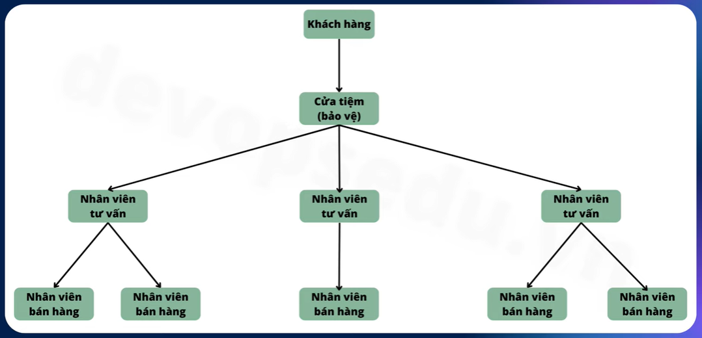

- Hướng nghiên cứu từ node -> services -> Ingress (Ingress controller) -> traffic và hướng đi thì ngược lại
### 3.1.1. Yaml trong k8s
- Ưu điểm: 
    - Cú pháp đơn giản (key: value)
    - Định dạng phong phú
        - Dạng list: thêm dấu - ở trước -> thành 1 danh sách 
    - Cấu trúc rõ ràng: lùi vào đúng dòng sẽ thành cấu trúc con
    - Cộng đồng lớn
- Thành phần cấu trúc yaml:
    - apiVersion: v1, apps/v1, batch/v1
    - kind: thuộc tính để khai báo các tài nguyên

        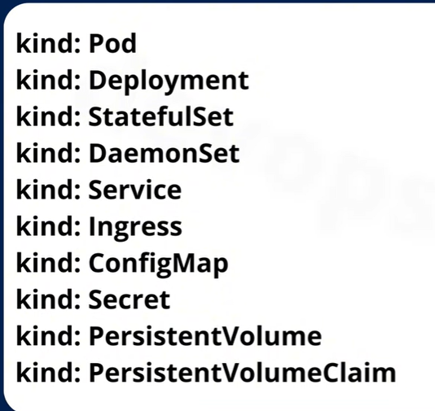
    - metadata: chứa các thông tin liên quan đến tài nguyên (tên, nhãn, namespace)
    - spec: Định nghĩa chi tiết cấu hình của tài nguyên

        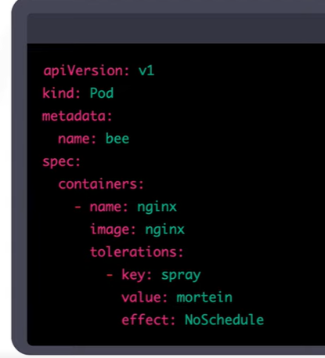
### 3.1.2. Namespace k8s
```
Là 1 cách tổ chức và phân tách các tài nguyên trong 1 cụm k8s để quản lý tốt hơn. Nó được sử dụng để chia nhỏ tài nguyên của 1 cụm lớn thành các không gian làm việc logic nhỏ hơn, giúp dễ dàng quản lý và vận hành hơn.
```

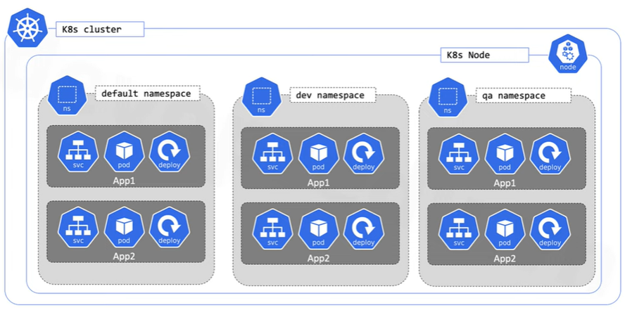

    Giúp quản lý và phân chia tài nguyên 1 cách rõ ràng hơn khi có nhiều nhóm làm vc trên 1 cụm dựa trên CPU, ram, phân tách các môi trường giúp quản lý tập trung và tối ưu chi phí, tài nguyên này, ai được cấu hình trên nó

- Mặc đinh trên k8s sẽ có 1 cụm mặc định là default: 
    ```
    kubectl get pod --namespace default
    kubectl get ns
    ```
- Tạo 1  namespace riêng để cho 1 không gian riêng cho dự án sau đó xóa 
    ```
    kubectl create ns project-1
    kubectl delete ns project-1
    ```
- Tạo file yaml để dễ cấu hình và lưu trữ

    ```
    mkdir projects
    cd projects
    mkdir project-1
    cd project-1
    vi ns.yaml

    apiVersion: v1
    kind: Namespace
    metadata:
        name: project-1

    Áp dụng cấu hình: 
    kubectl apply -f ns.yaml
    kubectl get ns

    Xóa cấu hình: 
    kubectl delete -f ns.yaml
    ```

- Cấu hình giới hạn tài nguyên cho namespace sử dụng: `vi resourcequota.yaml`
    ```
    apiVersion: v1
    kind: ResourceQuota
    metadata: 
        name: mem-cpu-quota
        namespace: project-1
    spec: 
        hard:
            requests.cpu: "2"
            requests.memory: 4Gi
    
    kubectl apply -f resourcequota.yaml
    ```
## 3.2. Tư duy triển khai dự á trên Kubernetes
- 

## 3.3. Các công cụ quản lý k8s 
- Có 3 loại chính: command, desktop, website đều có ưu, nhược điểm riêng
- Search "k8s management tools"
- Ưu tiên công nghệ opensource: k9s, lens k8s, rancher 
## 3.4. Cài đặt Rancher và kết nối Kubernetes
    Rancher là 1 cc giúp triển khai và quản lý và giám sát nhiều cụm k8s trên các môi trường khác nhau, bao gồm On-premies và các nhà cc dịch vụ đám mây như AWS, Azure, GG, ... 

### 3.4.1. Rancher làm được gì? 
- Quản lý nhiều cụm K8s
- Phân quyền mạnh mẽ (Based RBAC K8s)
- Hỗ trợ giám sát cụm k8s
- Bảo mật tốt
### 3.4.2. Các cách cài đặt
- Có 2 cách chính: 
    - Chạy bằng docker thuần
    - Chạy trực tiếp k8s
#### 3.4.2.1. Chạy bằng docker
- Tạo 1 server mới 1 processors, 2 Gi RAM, tạo thêm 1 ổ cứng với 20Gi
    ```
    | rancher-server | 192.168.1.144 | rancher-server | 2GB | 1 | 20GB | 20GB | rancher.server.tech
    ```
    Cấu hình host, ip, hostname reboot 

- format ổ cứng sdb gán ổ cứng vào thư mục /data
    ```
    mkfs.ext4 -m 0 /dev/sdb
    mkdir /data
    echo "/dev/sdb /data ext4 default 0 0" | tee -a /etc/fstab
    
    cat /etc/fstab
    mount -a  
    df -h
    ```
- Cài đặt rancher bằng docker
    ```
    apt update 
    apt install docker.io
    apt install docker-compose
    ```
- Search "rancher version matrix" -> chọn phiên bản phù hợp với k8s 

    ```
    mkdir /data/rancher
    cd /data/rancher
    vi docker-compose.yml

    version: '3'
    services:
        rancher-server:
            image: rancher/rancher:v2.9.2
            container_name: rancher-server
            restart: unless-stopped
            ports:
                - "80:80"
                - "443:443"
            volumes:
                - /data/rancher/data:/var/lib/rancher   
            privileged: true


    docker-compose up -d
    docker ps -a 
    ```
- Truy cập vào web rancher bằng địa chỉ ip của rancher-server https://192.168.1.144
- Lấy mật khẩu Rancher và thiết lập lại mk
    ```
    docker logs rancher-server 2>&1 | grep "Bootstrap Password:"
    ```
- Nối cụm k8s trên rancher để quản lý 
    - Chọn Import Exitsting có 2 lựa chọn chính: (chọn generic)

        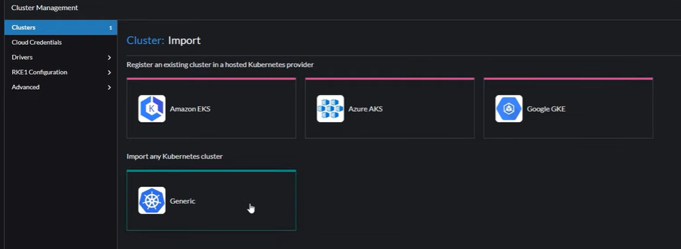

    - Cluster Name: learnmyselfvn là cụm k8s dựng nên, nhằm mục đích gì, ghi cụ thể và tường minh 
    - Copy dòng tự ký và sau khi tải về lấy được 1 file yaml và apply file yaml đó và tài nguyên đã được tạo.

#### 3.4.2.2. Cài đặt trên Rancher trên Cloud (GCP)
- Tạo 1 VM để cài rancher lên đó
    - Vào Compute engine -> VM Instance -> Create Instance
        ```
        Name: rancher-server
        Region: (asia-Tokyo)
        Zone: asia-..-c
        ```
    - Machine config: e2-medium 
    - OS and storage: Ubuntu - size 20Gi
        + add new disk: 20Gi
            - Name: disk-mount-data-rancher
            - Source: Blank
            - Size: 40Gi
    - Networks
        - Enable: http, https
- Sau khi đã hoàn tất thì ssh vào và cấu hình 
    - Update, cài đặt docker, docker-compose
    - Tiến hành mount disk rỗng đã được tạo trước đó như ở trên 
        ```
        sudo mkfs.ext4 -m 0 /dev/sdb
        mkdir /data
        echo "/dev/sdb  /data  ext4  defaults  0  0" | sudo tee -a /etc/fstab
        mount -a
        sudo df -h
        ```
    - Docker run trên server 
        ```
        docker run --name rancher-server -d --restart=unless-stopped -p 80:80 -p 443:443 -v /data/rancher:/var/lib/rancher --privileged rancher/rancher:v2.9.2
        ```
    - Sau đó truy cập vào địa chỉ public đã được cấp, khi tắt máy thì địa chỉ public này se bị thay đổi
    - Truy cập vào vpc network -> ip addressses -> Reserver externel -> tạo ra được 1 địa chỉ public ip và gán được vào máy ảo
    - Lấy mật khẩu và vào trang chính giao diện
    
        ```
        docker logs  rancher-server  2>&1 | grep "Bootstrap Password:"
        ```

## 3.5. Pod K8s
    Là đơn vị triển khai nhỏ nhất và đơn giản nhất trong k8s 1 pod sẽ đại diện cho 1 hoặc nhiều container được nhóm lại với nhau rồi chia sẽ tài nguyên cũng như là mạng 
    Mỗi pod có một ip riêng có thể hiểu  nó như một môi trường chia sẽ hoặc là máy chủ ứng dụng 

- Không nên chạy độc lập các pod: 
    - Thiếu khả năng tự động khôi phục (self-healing) nó sẽ không tự động tạo lại nếu bị lỗi hoặc xóa 
    - Không quản lý được số lượng bản sao (replica): chạy độc lập chỉ có 1 bản duy nhất nếu muốn chạy nhiều bản phải tự tạo thử công, không hiệu quả và dễ lỗi 
    - Không hỗ trợ cập nhật tự động(rolling update)
    - Không hỗ trợ quản lý trạng thái và lịch sử triển khai: không có lịch sử thay đổi, rollback hay phiên bản.
    - Thiếu khả năng tích hợp các công cụ quản lý cáo hơn: Các công cụ CI/CD, auto-scaling, monitoring,... thường làm việc với các đối tượng như Deployment chứ không phải Pod độc lập.

<div style="display: flex; justify-content: center; align-items: center;">
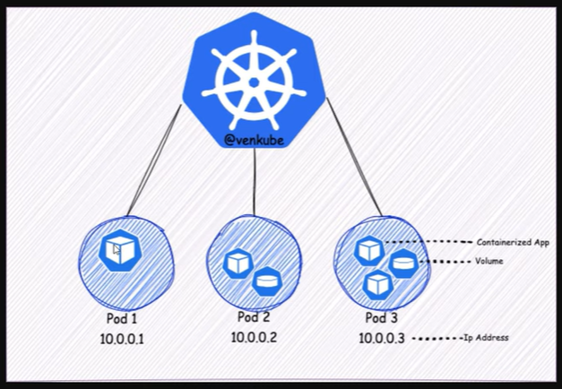
</div>

### 3.5.1. Triển khai ví dụ một pod 
Quay lại k8s-master-1 server và tạo ra thư mục project-1 bên trong /projects và truy cập vào [docker hub](https://hub.docker.com/) tạo thư mục riêng và tải car-serv của elroydevops về 

    cd projects/
    mkdir car-serv
    cd car-serv
vi ns.yaml
    
    apiVersion: v1 
    kind: Namespace
    metadata: 
        name: car-serv 
vi pod.yaml

    apiVersion: v1 
    kind: Pod
    metadata: 
        name: car-serv
        namespace: car-serv
    spec: 
        containers:
          - name: car-serv
            image: elroydevops/car-serv
            ports:
            - containerPort: 80
<br>
    
    kuberctl apply -f ns.yaml 
    kuberctl apply -f pod.yaml
    kublectl get pod -n car-serv

<br> Truy cập vào bên trong môi trường container

    kubectl exec -it car-serv -n car-serv -- /bin/bash
    ls /usr/share
<h3>*Chỉ nên triển khai 1 container trên 1 pod để giảm thiểu tối da sự phụ thuộc

#### 3.5.1.1. Cấu hình chịu tải cho pod
    kubectl -get delete -f pod.yaml

## 3.6. Deployment k8s 
    Không nên chạy độc lập các pod như đã nói ở pod ta nên sử dụng các workload resource như Deployment hoặc Job để hoạt động đúng cách và chạy nhiều pod.
    Khi sử dụng Deployment ta có thể phân bổ được bao nhiêu pod được chạy đồng thời giống nhau đảm bảo được website chạy ổn định 
    Là 1 đối tượng để quản lý pod, có thể quản lý phiên bản ứng dụng, lưu lịch sử, scale ứng dụng, tự dộng khôi phục lỗi khởi tạo lại 1 pod mới
### 3.6.1. Ví dụ một file yaml Deployment đơn giản 
    apiVersion: apps/v1           # API version cần thiết cho Deployment
    kind: Deployment              # Kiểu đối tượng là Deployment
    metadata:
    name: nginx-deployment      # Tên của Deployment
    labels:
        app: nginx                # Nhãn gắn cho Deployment (không bắt buộc)
    spec:
    replicas: 2                 # Số lượng Pod muốn chạy
    selector:
        matchLabels:
        app: nginx              # Deployment sẽ quản lý các Pod có label này
    template:                   # Mẫu để tạo các Pod
        metadata:
        labels:
            app: nginx            # Nhãn gắn cho Pod (phải khớp với selector)
        spec:
        containers:
        - name: nginx           # Tên container trong Pod
            image: nginx:1.25     # Ảnh Docker để chạy container
            ports:
            - containerPort: 80   # Mở cổng trong container
---
    apiVersion: apps/v1
    kind: Deployment
    metadata:
    labels:
        workload.user.cattle.io/workloadselector: apps.deployment-car-serv-car-serv-deployment
    name: car-serv-deployment
    namespace: car-serv
    spec:
    replicas: 2
    revisionHistoryLimit: 11
    selector:
        matchLabels:
        workload.user.cattle.io/workloadselector: apps.deployment-car-serv-car-serv-deployment
    template:
        metadata:
        labels:
            workload.user.cattle.io/workloadselector: apps.deployment-car-serv-car-serv-deployment
        namespace: car-serv
        spec:
        containers:
            - image: elroydevops/car-serv
            imagePullPolicy: Always
            name: car-serv
            ports:
                - containerPort: 80
                name: tcp
                protocol: TCP
    
- Với mô hình ở dưới: 
    <div style="display: flex; justify-content: center; align-items: center;">
        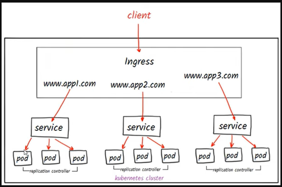
    </div> <br>

    ```
    Ta không thể thấy được deployment bởi vì  đi từ bên ngoài vào chỉ xác định được pod là gì, và service sẽ làm việc với deployment để đảm bảo chiến lược đó sẽ đủ pod và hiệu quả 
    ```

## 3.7. Các câu lệnh Deployment K8s
- 
    | Nội dung | Câu lệnh |
    |---|---|
    |Lấy danh sách Deployment | `kubectl get deployment -n car-serv` |
    |Lấy danh sách ReplicaSet | `kubectl get rs -n car-serv` |
    |Edit deployment|`kubectl edit deployment -n car-serv`|
    |Xem rollout status|`kubectl rollout status -n ...`|
    |Cập nhật trực tiếp số lượng replicas|`kubectl scale deployment <ten-deployment> --replicas=<so-replicas> -n <ns>`|
    |Xem chi tiết cụ thể về một Deployment|`kubectl describe deployment -n <namespace>`|
    |Xem cấu hình YAML của một Deployment|`kubectl get deployment <ten-deployment> -o yaml`|
    |Cập nhật Deployment bằng cách thay đổi hình ảnh container|`kubectl set image deployment/<ten-deployment> <ten-container>=<ten-image>:<tag-moi>`|
    |Rollback Deployment về phiên bản trước|`kubectl rollout undo deployment <ten-deployment>`|
    |Kiểm tra lịch sử các phiên bản của Deployment|`kubectl rollout history deployment <ten-deployment>`|
    |Liệt kê các Pod được tạo bởi một Deployment cụ thể|`kubectl set env deployment/<ten-deployment> <key>=<value>`|
    |Cập nhật biến môi trường cho các container trong Deployment|`kubectl set env deployment/<ten-deployment> <key>=<value>`|

- Auto scale: tự động tăng giảm pod khi có số lượng truy cập tăng cao thì hệ thống scale lên hoặc scale xuống 
- Pause, Resume: Giúp kiểm soát được phiên bản trước khi triển khai các pod
## 3.8. Các chiến lược deployment k8s
- Có 2 chiến lược triển khai chính Rolling update và Recreate<br>
    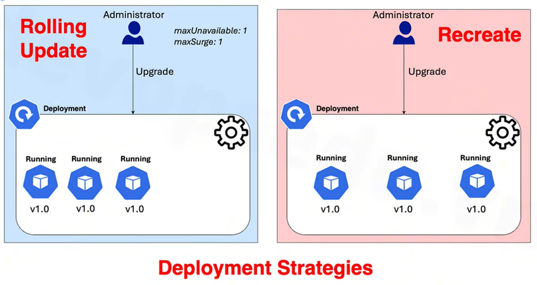
    </br>
    ```
    Rolling Update: Cập nhật lần lượt các pod 
    Recreate: Tạo mới hoàn toàn các pod
    ```
### 3.8.1. Rolling Update
```Ví dụ: Ta có 2 pod, khi triển khai version mới chúng ta thiết lập 1 pod mới lên thì xóa 1 pod cũ đi thì ta sẽ có 1 pod cũ và 1 pod mới -> đảm bảo dự án hoạt động được``` 
- Được áp dụng trong hầu hết các trường hợp
- Khi cập nhật version mới thì version cũ vẫn đang hoạt động
- Chiến lược mặc định kho 0 cấu hình 

    ```
    Thêm trường strategy vào bên dưới replicas

    strategy:
        type: RollingUpdate
    -> Thêm dần các pop mới lên và xóa các pod cũ:
        rollingUpdate:
            maxSurge: Là số lượng pod mới được phép tạo thêm (vượt quá số replicas ban đầu) trong quá trình cập nhật.

            maxUnavalilabe: Là số lượng pod cũ được phép "mất" (tạm dừng hoặc xóa) tại cùng một thời điểm trong quá trình update.
    ....
    template:
        ....
        containers: 
        # image: elroydevops/car-serv
        image: nginx
    
    Sau đó import apply vào rancher 
    ```
- Để việc update được diễn ra thì thường cập nhật image container, sửa file yaml,... 
### 3.8.2. Recreate
```Ví dụ: Xóa toàn bộ pod và khởi tạo lại toàn bộ pod```
- Triển khai nhanh
    ```
    Thêm trường strategy vào bên dưới replicas

    strategy:
        type: Recreate
    ....
    template:
        ....
        containers: 
        # image: elroydevops/car-serv
        image: nginx
    
    Sau đó import apply vào rancher 
    ```
-> Nó sẽ xóa toàn bộ các pod đi và tiến hành khởi tạo nên pod mới -> Khi cập nhật thì có thể image có thể rất nặng thì nó sẽ xảy ra downtime
=> Sử dụng chạy job, chạy tác vụ clean data, clean version và tạo version mới 
## 3.9. Services
Là 1 đối tượng dùng để định nghĩa cách tiếp cận đến các pod thường là 1 nhóm pod hay là việc triển khai các pod qua deployment trong k8s

Đóng vai trò điều phối traffic vào trong các pod 
- Có 4 loại chính 

    | Loại | Mục đích | Truy cập từ |
    | --- | --- | --- |
    | **ClusterIP (mặc định)** | Cho phép các Pod **trong cluster** giao tiếp với nhau | Nội bộ cluster |
    | **NodePort** | Mở cổng trên mỗi Node để truy cập app từ **bên ngoài cluster** | Từ bên ngoài (IP node + port) |
    | **LoadBalancer**         | Tích hợp với cloud provider để tạo IP public                   | Truy cập ngoài internet       |
    | **ExternalName**         | Trỏ đến một hostname bên ngoài cluster                         | Dùng DNS alias                |

- NodePort: mở 1 port từ ứng dụng ra bên ngoài, truy cập trực tiếp vào pod mà không đi qua bất kỳ đường nào.
- Loadbalancer: Điều phối lưu lượng đến các pod tương ứng, phải đi qua 1 cỗng nữa r mới qua được k8s 
- ExtenalName: Lk với 1 domain ở bên ngoài, koong tương tác vs k8s mà tương tác vs domain

### 3.9.1. NodePort
#### 3.9.1.1. On-premit
- Range port của service NodePort
    - Thường được sử dụng dãy port từ **30000-32767**
- Sử dụng NodePort
    - Tạo service để truy cập được vào tài nguyên 
    - Service Discovery -> Services -> Node Port 
    ```
    Name: car-serv-service 
    Portname: TCP
    Listening port: 80 
    Target port: 80
    Node port: 32000
    ```
    - Selector: Chỉ định deployment nào
    ```
    Key: app
    Values: Đặt trùng với labels app:
    ```
- Thường không được sử dụng và chỉ được sd khi export ứng dụng ra bên ngoài nhanh chóng để có thể debug, thu thập thông tin,.. 
#### 3.9.1.2. On Cloud
- Truy cập vào server và thực hiện các lệnh
    ```
    mkdir devops
    cd devops
    vi car-serv.yaml
    ```
    ```
    apiVersion: apps/v1
    kind: Deployment
    metadata:
        name: car-serv-deployment
        namespace: car-serv
    spec:
        selector:
            matchLabels: 
                app: car-serv
        replicas: 1
        template:
            metadata:
                labels:
                    app: car-serv
            spect:
                containers:
                  - name: car-serv
                    images: elroydepops/car-serv
                    ports:
                        - containerPort: 80
    ---
    apiVersion: v1
    kind: Services
    metadata:
        name: car-serv-service
        namespace: car-serv
    spec: 
        type: NodePort
        selector:
            app: car-serv
        ports:
          - protocols
            port: 80
            targetPort: 80
            nodePort: 32000
    ```
    Tạo namespace
    ```
    kubectl create ns car-serv
    kubectl apply -f car-serv.yaml
    ```
    Lấy toàn bộ tài nguyên của car-serv
    ```
    kubectl get all -n car-serv
    kubectl get node -o wide
    ```
    Mở Firewall:  Kube Engine -> VPC networks -> firewall -> create firewall rule
    ```
    Name: allow port 32000  
    target: All instance, ... 
    Source: 0.0.0.0/24
    Specified ...
        TCP: 32000 
    -> Create 
    ```

### 3.9.2. ClusterIP
- Khởi tạoL Service Discovery -> Services -> Create ClusterIP
`
Name: car-serv1-service
; PortName: tcp
; Listenning Port: 80
; Target Port: 80
`
- selectors: `Key: app; Value: car-serv-deployment`
## 3.10. Helm 
**Helm là trình quản lý package cho k8s dùng chart để deploy ứng dụng phức tạp - tương tự như apt trong ubuntu hay yum trong CentOS, nhưng dành cho ứng dụng chạy trong k8s Giúp tái sử dụng YAML, cấu hình linh hoạt qua biến**

### 3.10.1. Mục đích của Helm
| Tính năng                 | Mô tả                                                           |
| ------------------------- | --------------------------------------------------------------- |
| 🧳 Đóng gói ứng dụng      | Helm dùng các **Chart** để đóng gói cấu hình Kubernetes         |
| ⚙️ Tái sử dụng & cấu hình | Cho phép tái sử dụng YAML với biến động cao, dễ tùy chỉnh       |
| 🧠 Quản lý version        | Triển khai, nâng cấp, rollback phiên bản ứng dụng               |
| 📈 Triển khai nhanh       | Có thể deploy 1 ứng dụng phức tạp chỉ với 1 lệnh `helm install` |

### 3.10.2. Cấu trúc của Helm Chart 
Một Helm Chart là một thư mục chứa các cái template:
```
mychart/
├── Chart.yaml        # Metadata của chart (tên, version, mô tả...)
├── values.yaml       # Giá trị cấu hình mặc định (biến)
├── templates/        # Các file YAML Kubernetes có thể dùng biến
│   ├── deployment.yaml
│   ├── service.yaml
│   └── _helpers.tpl  # Hàm template phụ
```

Cách hoạt động:
```
Viết các template YAML như deployment.yaml, service.yaml...
Định nghĩa các giá trị (biến) trong values.yaml
Khi chạy: `helm install myapp ./mychart` 
→ Helm sẽ render các template với giá trị, và tạo tài nguyên Kubernetes tương ứng
```

### 3.10.3. Một số lệnh Helm cơ bản

| Lệnh               | Tác dụng                      |
| ------------------ | ----------------------------- |
| `helm install`     | Cài ứng dụng                  |
| `helm upgrade`     | Nâng cấp ứng dụng             |
| `helm uninstall`   | Gỡ ứng dụng                   |
| `helm list`        | Liệt kê các release đang chạy |
| `helm repo add`    | Thêm Helm repository          |
| `helm search repo` | Tìm ứng dụng trong repo       |
| `helm template`    | Render YAML ra xem trước      |
### 3.10.4. Helm Repo là gì?
> **Helm cho phép bạn sử dụng các Helm Chart đã được viết sẵn từ cộng đồng.**

- Ví dụ: 
    ```
    helm repo add bitnami https://charts.bitnami.com/bitnami
    helm install my-nginx bitnami/nginx
    ```
→ Deploy nginx cực nhanh, có thể custom qua --set hoặc -f values.yaml
### 3.10.5. Lợi ích của Helm
| Ưu điểm          | Lợi ích thực tế                                           |
| ---------------- | --------------------------------------------------------- |
| Tái sử dụng      | 1 chart có thể dùng cho nhiều môi trường                  |
| Quản lý config   | Dễ chỉnh bằng `values.yaml` hoặc `--set`                  |
| Triển khai nhanh | Nhiều ứng dụng lớn (MySQL, Redis, Jenkins...) đã có chart |
| Rollback dễ dàng | Dễ trở lại version trước nếu lỗi                        |

## 3.11. Ingress 
### 3.11.1. On-Premit
- Tài nguyên quản lý cách thức truy cập từ bên ngoài vào services bên trong k8s
- Giúp điều hướng lưu lượng http/ https tới các service nội bộ và thường thông qua một ingress Controller (ví dụ: NGINX Ingress Controller).
- Thực tế thường dùng Nginx ingress, HAProxy, Kong Ingress Controller
#### 3.11.1.1. Thành phần chính của Ingress:
- Ingress Resource (file YAML định nghĩa đường routing)
- Ingress Controller (phần mềm thực tế xử lý routing, ví dụ: NGINX, Traefik, HAProxy, Contour...)
#### 3.11.1.2. Cài đặt và cấu hình Nginx Ingress Controller 
- Search: `Nginx Ingress` -> `Installation` -> `Intall NGINX ...` -> `Install with Helm`
- Thông thường khi triển khai các dự án k8s ta hay có các file deployment, services, ingress,... Thay vì từng dự án ta phải apply như vậy thì ta chỉ cần đóng gói thành 1 template đầy đủ các file deployment, services, ... sau này khi triển khai dự án ta chỉ cần lôi template này ra và sử dụng, chỉ cần thay đổi 1 số các giá trị, port, tên, services,... 
- Cài đặt Helm: Search`Helm release`
- Sử dụng user root ở master-1 
    ```
    wget https://get.helm.sh/helm-v3.16.2-linux-amd64.tar.gz
    tar xvf helm-v3.16.2-linux-amd64.tar.gz
    sudo mv linux-amd64/helm /usr/bin/
    helm version
    ```
- Cài đặt Ingress controller
    ```
    helm repo add ingress-nginx https://kubernetes.github.io/ingress-nginx
    helm repo update
    helm search repo nginx
    helm pull ingress-nginx/ingress-nginx
    tar -xzf ingress-nginx-4.11.3.tgz
    
    vi ingress-nginx/values.yaml

     Sửa type: LoadBalancing => type: NodePort
     Sửa nodePort http: "" => http: "30080"
     Sửa nodePort https: "" => https: "30443"
    kubectl create ns ingress-nginx
    helm -n ingress-nginx install ingress-nginx -f ingress-nginx/values.yaml ingress-nginx
    ```

-> Sau khi đã thêm thành công ta copy các dòng được hiển thị 
#### 3.11.1.3. Triển khai loadbalancer
- Loadbalance: cân bằng tải các node pod của k8s đi ra bên ngoài client (Nginx hoặc HAProxy)
- Tạo 1 server loadbalance riêng: **`|loadbalancer|192.168.1.110|loadbalancer-k8s|1GB|CPU 1|Disk 20|`** <br>

    ```
    Đổi hostname: loadbalancer
    Địa chỉ IP: 192.168.1.110
    sudo -i

    apt install nginx -y
    vi /etc/nginx/sites-available/default
    Đổi port listen thành port khác 9999 chẳng hạn
    ```
    vi /etc/nginx/conf.d/devopsedu.vn.conf
    ```
    upstream my_servers {
    server 192.168.1.111:30080;
    server 192.168.1.112:30080;
    server 192.168.1.113:30080;
    }

    server {
        listen 80;

        location / {
            proxy_pass http://my_servers;
            proxy_redirect off;
            proxy_set_header Host $host;
            proxy_set_header X-Real-IP $remote_addr;
            proxy_set_header X-Forwarded-For $proxy_add_x_forwarded_for;
            proxy_set_header X-Forwarded-Proto $scheme;
        }
    }
    
    nginx -t 
    systemctl restart nginx
    ```
- Vào rancher truy cập vào Ingresses -> Copy file yaml từ lúc cài đặt Ingress controller 
    ```
    apiVersion: networking.k8s.io/v1
    kind: Ingress
    metadata:
        name: car-serv-ingress
        namespace: car-serv
    spec:
        ingressClassName: nginx
        rules:
            - host: car-serv-onpre.devopsedu.vn
            http:
                paths:
                - backend:
                    service:
                        name: car-serv1-service
                        port:
                        number: 80
                    path: /
                    pathType: Prefix
    ```
- Add host trên win 192.168.1.110 car-serv-onpre.devopsedu.vn
### 3.11.2. On Cloud
- Xóa các resource đã khởi tạo 
`kubectl delete -f car-serv.yaml`
- Cài đặt helm, cài ingress nginx 
    ```
    wget https://get.helm.sh/helm-v3.16.2-linux-amd64.tar.gz
    tar xvf helm-v3.16.2-linux-amd64.tar.gz
    sudo mv linux-amd64/helm /usr/bin/
    helm version
    ```
    ```
    helm repo add ingress-nginx https://kubernetes.github.io/ingress-nginx
    helm repo update
    helm pull ingress-nginx/ingress-nginx
    tar -xzf ingress-nginx-4.11.3.tgz
    - Giữ nguyên cấu hình type là loadbalancer trên cloud
    kubectl create ns ingress-nginx
    helm -n ingress-nginx install ingress-nginx -f ingress-nginx/values.yaml ingress-nginx
    ```
- Tạo ra 1 file với deployment car-serv-dp-sv-ig
    ```
    apiVersion: apps/v1
    kind: Deployment
    metadata:
        name: car-serv-deployment
        namespace: car-serv
    spec:
        selector:
            matchLabels: 
                app: car-serv
        replicas: 1
        template:
            metadata:
                labels:
                    app: car-serv
            spect:
                containers:
                  - name: car-serv
                    images: elroydepops/car-serv
                    ports:
                        - containerPort: 80
    ---
    apiVersion: v1
    kind: Services
    metadata:
        name: car-serv-service
        namespace: car-serv
    spec: 
        type: ClusterIP
        selector:
            app: car-serv
        ports:
          - protocols: TCP
            port: 80
            targetPort: 80
    ---
    apiVersion: networking.k8s.io/v1
    kind: Ingress
    metadata:
        name: car-serv-ingress
        namespace: car-serv
        annotations:
            kubernetes.io/ingress.class: "nginx"
    spec:
        rules:
            - host: car-serv-cloud.devopsedu.vn
            http:
                paths:
                - backend:
                    service:
                        name: car-serv1-service
                        port:
                        number: 80
                    path: /
                    pathType: Prefix
    ```
-> Lưu và Apply cấu hình: `kubectl apply -f car-serv-dp-ig.yaml`
- Vào trình quản lý domain và trỏ domain vào cái public ip của loadbalancer 
- Tiến hành tìm ip để trỏ tới: `kubectl get all -n car-serv`, `kubectl get ingress -n car-serv`-> address vào host
## 3.12. Template yaml 
- Ở các phần trên ta đã triển khai owr Op-premit: deployment, services, Ingress -> download các file cấu hình này về sau đó tối ưu file tất cả phần nào là cấu hình mặc định như annoitaion, timestamp hay managerFied thì sẽ xóa bỏ 
## 3.13. Triển khai dự án Fullstack
### 3.13.1. Mô hình dự án 
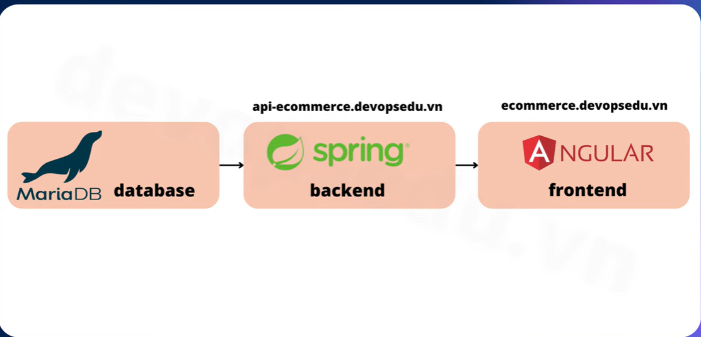
```
Database: Mariadb 
Backend: java string boot api
Frontend: Angular
Triển khai phương án fullstack với backend có domain là api-ecommerce.networks.vn và frontend có domain là ecommerce.networks.vn cần phải có 1 server để chứa database 
```
- Tạo ra 1 server: `|database|192.168.1.115|database-server|2GB|1|`

    ```
    apt update -y
    apt install mariadb-server
    vi /etc/mysql/mariadb.conf.d/50-server.cnf
    bind-add: 0.0.0.0
    systemctl restart mariadb
    ```
- Tải file dự án xuống 
    **Nếu muốn đổi lại domain thì hãy tìm kiếm trong thư mục của dự án tất cả các domain "devopsedu.vn" và thay thế thành domain mà mình muốn**
- Sau đó tiến hành pull dự án đó lên dockerhub hoặc registry, đơn giản hơn là chuyển file dự án đó vào trong server để build sau khi chuyển dự án vào thư mục tmp thì giải nén và cài đặt docker
    ```
    Trên win: scp /file.zip ip@username:/tmp
    Trên server linux:
        unzip file.zip 
        mkdir /projects
        cp /tmp/file.zip /projects
        apt install unzip
        apt install docker.io 
    ```
#### 3.13.1.1. Frontend
- Di chuyển đến thư mục frontend và trong đó có chứa 1 Dockerfile build nó lên 
    ```
    docker build -t ecommerce-frontend:v1 . 
    docker images
    ```
- Sau đó push lên dockerhub: 
    ```
    docker login
    docker tag ecommerce-frontend:v1 username/ecommerce-frontend:v1 
    docker images
    docker push
    ```
- Với cấu trúc file được build sẵn deployment, và các chức năng khác hoàn chỉnh ở phần loadbancer ta lấy về và thay đổi tên dự án và tên docker images đã push ở trên về và apply lại trên rancher 
- Tạo Project ecommerce và namespace là ecommerce, nen tách ra các project nhỏ giữa các dự án để có thể dễ dàng phân quyền hơn 
- Import YAML mà đã sửa ở trên vào -> kiểm tra cá giá trị -> Build thành công 
#### 3.13.1.2. Backend
- Trở lại database-server và di chuyển vào thư mục 02-backend và vào file application.properties sửa cấu hình địa chỉ đúng đến database-server 192.168.1.115
- Chạy các dữ liệu database trước để tránh gặp lỗi 
- Vào lại thư mục 01 sử dụng lệnh `pwd && ls` để lấy chính xác cái path để cấu hình database 
    ```
    mysql 
    source ... (Với đường dẫn ở trên và từng file database)
    show tables
    ```
- Quay trở lại project 02-backend trong này có sẵn 1 docker file 
    ```
    docker build -t ecommerce-backend:v1
    docker tag ecommerce-backend:v1 username/ecommerce-backend:v1
    docker push username/ecommerce-backend:v1
    ```
- Sau khi push lên dockerhub ta quay lại file yaml sửa chữa và thêm vào rancher
    ```
    Đổi deployment từ frontend thành backend
    Sửa container port là 8080
    Sửa domain: api-encommerce.networks.vn
    Apply trên rancher ở namespace ecommerce 
    ```
- Thành công
## 3.14. Configmaps
```
ConfigMap là một đối tượng API trong Kubernetes cho phép lưu trữ dữ liệu cấu hình không nhạy cảm dưới dạng cặp key-value. 
Điều này giúp tách biệt cấu hình môi trường khỏi hình ảnh container, làm cho ứng dụng dễ dàng di chuyển và quản lý hơn.
```
### 3.14.1. Mục đích sử dụng ConfigMap
- Tách biệt cấu hình khỏi mã nguồn: Giúp quản lý cấu hình môi trường riêng biệt, tránh việc phải chỉnh sửa và rebuild lại hình ảnh container khi có thay đổi về cấu hình.
- Quản lý cấu hình cho nhiều môi trường: Dễ dàng tạo và áp dụng các cấu hình khác nhau cho các môi trường như phát triển, kiểm thử và sản xuất.
### 3.14.2. Cách tạo và sử dụng ConfigMap
- Từ file hoặc thư mục:
`kubectl create configmap my-config --from-file=path/to/directory/`
- Lệnh này sẽ tạo một ConfigMap với mỗi file trong thư mục được chuyển thành một cặp key-value, trong đó key là tên file và value là nội dung file. 
- Cú pháp yaml có 2 cách: 
  - Cách 1: Sử dụng cấu trúc key và value 
    ```
    data:
        # property-like keys; each key maps to a simple value
        player_initial_lives: "3"
        ui_properties_file_name: "user-interface.properties"
    ```
  - Cách 2: Khai báo dưới dạng file
    ```
    data:
        # file-like keys
        game.properties: (tên file)|
            enemy.types=aliens,monsters
            player.maximum-lives=5    
        user-interface.properties: |
            color.good=purple
            color.bad=yellow
            allow.textmode=true  
    ```
- Sửa lại dockerfile ở backend vì chưa chỉ định bất cứ một cấu hình nào để đọc được file nên mặc định nó sẽ lấy file gốc trong thư mục của dự án
- Cần phải chỉ định đến file config trong container 
    ```
    ENTRYPOINT java ... --spring.config.location=/run/src/main/resources/application.properties
    ```
- Tạo 1 configmaps với nội dun file và cấu hình của application.properties và map vào đường dẫn trên ở container thì lúc đó dự án backend có thể đọc được file cấu hình
- Lưu lại và build lại file cấu hình và chừng sau sẽ chỉ cần cấu hình lại ở trên configmaps thôi không cần build lại dockerfile 
    ```
    docker images 
    docker build -f username/ecommerce-backend:v2 .
    docker push username/ecommerce-backend:v2
    ```
- Quay lại rancher và tạo tài nguyên configmaps 
    ```
    apiVersion: v1
    kind: ConfigMap
    metadata:
        name: ecommerce-backend-application-properties-configmap
        namespace: ecommerce
    data: 
        application.properties: |
            spring.datasource.url=jdbc:mysql://192.168.1.115:3306/full-stack-ecommerce #chú ý thay đổi địa chỉ IP của bạn 
            spring.datasource.username=ecommerceapp
            spring.datasource.password=StrongPa55WorD
            spring.datasource.driverClassName=com.mysql.cj.jdbc.Driver
            spring.datasource.sql-script-encoding=UTF-8

            spring.jpa.properties.hibernate.globally_quoted_i/dentifiers=true
            spring.jpa.properties.hibernate.dialect=org.hibernate.dialect.MySQL8Dialect
            spring.jpa.hibernate.ddl-auto=none
            spring.jpa.show-sql=true
            spring.jpa.properties.hibernate.format_sql=true

            spring.data.rest.base-path=/api
            spring.data.rest.detection-strategy=ANNOTATED

            allowed.origins=http://ecommerce.devopsedu.vn

            okta.oauth2.client-id=0oab0lzwjoN1Rjsar5d7
            okta.oauth2.issuer=https://dev-82108115.okta.com/oauth2/default
    ```
- Vào Storage Configmaps và chọn đúng namespace để hiển thị rõ
- Sau khi tạo xong thì phải mount configmaps vào dự án rồi thay đổi docker images 
- Khai báo volumes thẳng với container tên và volumeMounts: thẳng với image : khai báo tên giống với volumes và mountPath là đường dẫn được mount vào container 
- Edit yaml deployment
    ```
    spec:
        containers:
          - image: ...
            volumeMounts: 
                - mountPath: /run/src/main/resources/application.properties
                name: ecommerce-backend-application-properties-config-volume
                subPath: application.properties
        volumes:
          - configMap:
                defaultMode: 420
                name: ecommerce-backend-application-properties-configmap
          - name: ecommerce-backend-application-properties-config-volume
    ```
- Đầu tiên cần tạo 1 volume để có 1 vị trí lưu trữ dữ liệu của configmaps 
- Tiếp theo trong container mình sẽ tạo ra 1 volume mount nó sẽ mount giá trị của volume mà mình vừa tạo vào bên trong container đó ở trong thư mục /run/src/main/resources/application.properties 
- Vào deployment thử execute để kiểm tra xem thử có file đó chưa 
- Khi cập nhật cấu hìn mới thì mình cần redeploy lại và update image lại lên v2
### 3.14.3. Lưu ý 
- Không sử dụng ConfigMap cho dữ liệu nhạy cảm: ConfigMap không được thiết kế để lưu trữ thông tin nhạy cảm như mật khẩu, khóa API. Đối với dữ liệu nhạy cảm, hãy sử dụng đối tượng Secret của Kubernetes.
- Giới hạn kích thước: Dữ liệu trong ConfigMap không nên vượt quá 1 MiB. Nếu cần lưu trữ cấu hình lớn hơn, hãy xem xét sử dụng volume hoặc dịch vụ lưu trữ bên ngoài. 
- Cập nhật ConfigMap: Khi ConfigMap được cập nhật, các container sử dụng nó thông qua volume sẽ tự động nhận được thay đổi. Tuy nhiên, đối với các biến môi trường, cần phải khởi động lại Pod để áp dụng cấu hình mới. 
## 3.15. Secret
- Là đối tượng k8s dùng để lưu trữ dữ liệu nhạy cảm như: mật khẩu, token, ssh-key, chứng chỉ tls
- Thay vì lưu trực tiếp vào cấu hình pod, giúp bảo vệ thông tin nhạy cảm và quản lý dễ hơn.
- Mã hóa bằng base64 để đảm bảo dữ liệu được truyền qua không bị lỗi định dạng
### 3.15.1. Các loại secret phổ biến 

| Built-in Type	| Usage |
|---|---|
| Opaque	| arbitrary user-defined data (lưu trữ dưới dạng key-value) base64 | 
| kubernetes.io/service-account-token	| ServiceAccount token (Xác thực account) | 
| kubernetes.io/dockercfg	| serialized ~/.dockercfg file (Lưu trữ những thông tin đăng nhập của docker registry như username, password, token )| 
| kubernetes.io/dockerconfigjson	| serialized ~/.docker/config.json file (Lưu trữ những thông tin đăng nhập của docker registry như username, password, token) dưới dạng json | 
| kubernetes.io/basic-auth	| credentials for basic authentication (Chứa 2 loại giá trị) |
| kubernetes.io/ssh-auth	| credentials for SSH authentication | 
| kubernetes.io/tls	| data for a TLS client or server (Lưu trữ chứng chỉ) |
| bootstrap.kubernetes.io/token |	bootstrap token data (Lưu trữ token bootstrap được sử dụng khi muốn thêm 1 k8s cluster) |

### 3.15.2. Cách sử dụng 
- Opaque
    ```
    apiVersion: v1
    kind: Secret
    metadata: 
        name: ecommerce-backend-database-connection
        namespace:
    type: Opaque
    * Có 2 cách sử dụng ở đây 
    Cách 1: là nhập data và cái key phải được mã hóa trước với base64 
    Cách 2: là sử dụng stringData ghi giá trị chính xác, khi k8s sử lý sẽ chuyển sang dạng mã hóa 
    stringData:
        MARIADN_HOST: "192.168.1.115"
        MARIADB_DB: "full-stack-ecommerce"
        MARIADB_PORT: '3306'
        MARIADB_USERNAME: "ecommerceapp"
        MARIADB_PASSWORD: "StrongPa55WorD"
    ```
- Sau đó cần phải mount secret vào deployment như mapconfig (Sửa bằng file yaml hoặc giao diện rancher)
- Sửa trên giao diện (edit ) -> Enviroment Variables -> Secret -> file -> Save 
- Excuse vào trong container và kiểm tra xem các giá trị đã được truyền vào hay chưa 
- Vào lại configmap chỉnh sửa lại các thông số 
    ```
    HOST, PORT, DB
    USERNAME, PASSWORD
    Sau đó redepoy lại
    ```

* Nếu sử dụng Docker private Registry (Harbor)

- Step 0. Đảm bảo đã cài đặt Harbor như trong link hướng dẫn.
- Step 1. Cấu hình xác thực
Tạo secret chứa thông tin xác thực Harbor (Thực hiện trên server k8s-master-1 hoặc kubectl shell rancher)
    ```
    # kubectl create secret docker-registry auth-registry --docker-email=yourmail@gmail.com --docker-username=username-harbor --docker-password=password-harbor --docker-server=domain-harbor.com --namespace ecommerce
    ```
- Step 2: Thêm secret vào Deployment
    ```
    apiVersion: apps/v1
    kind: Deployment
    metadata:
        name: your-deployment
        namespace: your-namespace
    spec:
        replicas: 1
        selector:
            matchLabels:
            app: your-app
        template:
            metadata:
                labels:
                    app: your-app
            spec:
                containers:
                - name: your-container
                    image: harbor-domain.com/devopseduvn/ecommerce-backend:v1
                imagePullSecrets:
                - name: auth-registry # thêm tên secret như thế này
    ```
## 3.16. Request và limit 
Request: yêu cầu tài nguyên đại diện cho tài nguyên tối thiểu mà container cần để chạy ổn định, Số tài nguyên mà k8s dành riêng để đảm bảo container luôn luôn có thể chạy
Limit: lượng tài nguyên tối đa mà k8s được phép sử dụng 
### 3.16.1. Mục đích:
Đảm bảo container có đủ tài nguyên để hoạt động.
Tránh việc container chiếm dụng quá nhiều tài nguyên, ảnh hưởng đến các container khác.
### 3.16.2. Khác biệt

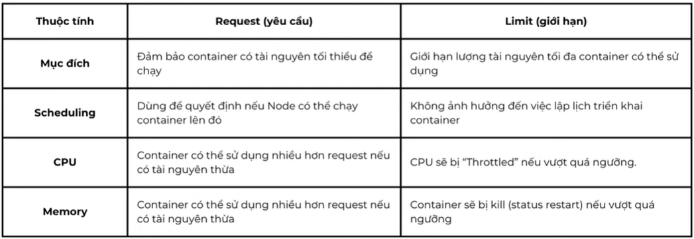
### 3.16.3. Các loại tài nguyên chính
- CPU:
    - Được đo bằng đơn vị cores (nhân CPU).
    - Có thể sử dụng giá trị thập phân (ví dụ: 0.5 = 500m – millicores).
    - Kubernetes sử dụng CPU shares (cơ chế Cgroups) để phân bổ CPU.
- Bộ nhớ (Memory):
    - Được đo bằng bytes (có thể dùng đơn vị Mi, Gi, Ki).
    - Ví dụ: 256Mi = 256 mebibytes, 1Gi = 1 gibibyte.
    - Kubernetes dùng cgroup để giới hạn bộ nhớ.

# 4. Xây dựng công cụ dự án 
# 5. Giám sát và quản trị Kubernetes 
# 6. Triển khai k8s trên k3s 
## 6.1. Bước 1: Gỡ cài đặt Kubernetes (kubeadm, kubelet, kubectl)
Chạy lệnh sau trên tất cả các node đã cài:

```
sudo kubeadm reset -f
sudo systemctl stop kubelet
sudo systemctl disable kubelet
sudo apt-mark unhold kubelet kubeadm kubectl
sudo apt purge -y kubelet kubeadm kubectl
sudo apt autoremove -y
```

Xoá thêm các file cấu hình (nếu có):
```
sudo rm -rf ~/.kube
sudo rm -rf /etc/kubernetes/
sudo rm -rf /var/lib/etcd
sudo rm -rf /var/lib/kubelet
```
## 6.2. Bước 2: (Tuỳ chọn) Gỡ containerd (nếu muốn dùng k3s tự cài containerd riêng)
```
sudo systemctl stop containerd
sudo systemctl disable containerd
sudo apt purge -y containerd.io
sudo rm -rf /etc/containerd /var/lib/containerd 
```
## 6.3. Bước 3: Tắt swap (bạn đã làm rồi), vẫn giữ nguyên.
## 6.4. Bước 4: Cài đặt K3s
### 6.4.1. Cấu hình sysctl
```
cat <<EOF | sudo tee /etc/sysctl.d/k8s.conf
net.bridge.bridge-nf-call-ip6tables = 1
net.bridge.bridge-nf-call-iptables = 1
EOF
sudo sysctl --system
```
### 6.4.2. Cài đặt k3s trên node đầu tiên (192.168.1.111)
```
curl -sfL https://get.k3s.io | sh -s - server \
  --cluster-init \
  --node-ip 192.168.1.111 \
  --node-external-ip 192.168.1.111 \
  --tls-san 192.168.1.111 \
  --tls-san 192.168.1.112 \
  --tls-san k8s-master-1 \
  --tls-san k8s-master-2 \
  --disable traefik \
  --disable servicelb \
  --write-kubeconfig-mode 644 \
  --node-taint "CriticalAddonsOnly=true:NoExecute"
```
Sau khi cài đặt xong, lấy token để join node thứ 2:
```
sudo cat /var/lib/rancher/k3s/server/node-token
```
### 6.4.3. Cài đặt k3s trên node thứ hai (192.168.1.112)
```
curl -sfL https://get.k3s.io | sh -s - server \
  --server https://192.168.1.111:6443 \
  --token <TOKEN_TỪ_MASTER_1> \
  --node-ip 192.168.1.112 \
  --node-external-ip 192.168.1.112 \
  --tls-san 192.168.1.111 \
  --tls-san 192.168.1.112 \
  --tls-san k8s-master-1 \
  --tls-san k8s-master-2 \
  --disable traefik \
  --disable servicelb \
  --write-kubeconfig-mode 644 \
  --node-taint "CriticalAddonsOnly=true:NoExecute"
```